# Orchid — Technical Report

**Project:** Orchid — AI-Powered Plant Care Assistant  
**Author:** Masud Lewis  
**Production URL:** https://orchid.masudlewis.com  
**Repository:** https://github.com/masudl-hub/orchidcare  
**Report Date:** March 2026

---

## Table of Contents

1. [Student Information](#1-student-information)
2. [Executive Summary](#2-executive-summary)
3. [Business Problem & Motivation](#3-business-problem--motivation)
4. [Solution Approach & Design Process](#4-solution-approach--design-process)
5. [System Architecture Overview](#5-system-architecture-overview)
6. [AI Agent — Orchid](#6-ai-agent--orchid)
7. [Telegram Channel Integration](#7-telegram-channel-integration)
8. [Real-Time Voice Call System](#8-real-time-voice-call-system)
9. [Progressive Web App (PWA)](#9-progressive-web-app-pwa)
10. [IoT Environmental Sensors](#10-iot-environmental-sensors)
11. [Data Layer & Database Models](#11-data-layer--database-models)
12. [Authentication & Security](#12-authentication--security)
13. [Memory & Context Engineering](#13-memory--context-engineering)
14. [Developer Platform & REST API](#14-developer-platform--rest-api)
15. [Results & Evaluation](#15-results--evaluation)
16. [Limitations, Future Work & Ethics](#16-limitations-future-work--ethics)
17. [References & AI Disclosure](#17-references--ai-disclosure)

---

## 1. Student Information

**Name:** Masud Lewis

### What I Built

Orchid is a conversational AI plant care assistant that lives wherever users already spend their time — Telegram, a browser-installed PWA, or a live voice call. Users send a photo of a struggling plant and receive an instant species identification, health diagnosis, and care plan. They can save plants to a persistent collection, set watering reminders, and receive proactive check-ins based on real care schedules. The assistant remembers everything across all channels: a conversation started on Telegram continues seamlessly in the PWA or voice.

### Tools & Technologies

| Layer | Technology |
|---|---|
| Frontend | React 18, TypeScript, Vite, TanStack Query, shadcn/ui, Tailwind CSS |
| PWA | vite-plugin-pwa, Workbox, Web App Manifest |
| Messaging | grammY 1.21 (Telegram Bot API), NDJSON streaming |
| Voice | Google GenAI SDK (`@google/genai`), Gemini Live WebSocket, PixiJS |
| Backend | Supabase Edge Functions (Deno runtime), PostgreSQL 15 |
| AI Models | Gemini 3 Flash, Gemini 3 Pro, Gemini 2.5 Flash Native Audio, Perplexity Sonar |
| AI Gateway | Lovable AI Gateway (OpenAI-compatible endpoint) |
| Database | Supabase Postgres with Row-Level Security |
| Storage | Supabase Storage (`plant-photos`, `generated-guides`) |
| Auth | Supabase Auth (JWT), Telegram HMAC-SHA256, Developer SHA-256 API keys |
| IoT | ESP32-WROOM-32, DHT11 (temp/humidity), BH1750 (lux), Capacitive Soil Moisture v2 |
| Deployment | Lovable Cloud (Supabase + Vite SPA) |

### Skills Developed

Through this project I developed production-grade skills in: multi-modal LLM integration (text, image, audio), agentic tool-calling loop design, multi-channel bot architecture, real-time WebSocket audio streaming, ephemeral token authentication flows, PostgreSQL RLS policy design, IoT sensor integration (ESP32 firmware, device authentication, real-time data pipelines), and technical documentation for engineering handoffs.

---

## 2. Executive Summary

Plant care is a $21B market dominated by passive apps that show generic watering schedules. These tools fail the moment a user encounters an unexpected yellow leaf, an unidentified specimen, or a care question that depends on their specific environment. The result is plant anxiety and preventable plant death.

**Figure 2.1: Orchid Homepage**

*The web entry point at orchid.masudlewis.com, illustrating the minimalist "Botanical Pixels" design language.*

Orchid solves this with a conversational AI assistant — the same name whether accessed through Telegram, a PWA, or a live voice call. The assistant is powered by a multi-modal Gemini 3 architecture routed through the Lovable AI Gateway, enriched with Perplexity Sonar for real-time research, and backed by a hierarchical memory system that spans a PostgreSQL database. The system is built on twelve Supabase Edge Functions running Deno, making it serverless and zero-infrastructure to operate.

**Key results:** Species identification from photos in under 3 seconds; proactive care reminders delivered via Telegram on user-defined schedules; sub-200ms PWA response latency for text queries; live voice calls with real-time audio streaming and a post-call memory pipeline; real-time IoT sensor monitoring with LLM-determined ideal ranges and automated alerts.

**Key limitations:** The onboarding state in `telegram-bot` is in-memory (lost on cold start); SMS/WhatsApp integration is blocked by business verification requirements; several RLS policies have prototype-level gaps; Supabase edge functions have a 400-second wall clock limit.

---

## 3. Business Problem & Motivation

### 3.1 The Problem

Amateur plant owners face a compounding information problem. Generic care guides give instructions like "water when the top inch of soil is dry," which is meaningless without knowing the pot size, soil mix, light exposure, seasonal context, and plant species. When something goes wrong — yellowing leaves, wilting, spots — the user turns to Google, Reddit, or YouTube and receives conflicting, context-free information. The result is decision paralysis and eventually plant death.

The status quo tools (Greg, Planta, Vera) are fundamentally passive: they deliver scheduled notifications but cannot engage with unexpected situations, learn from experience, or reason about photos. They are care calendar apps, not care assistants.

### 3.2 Target Users

- **Beginner plant owners** (first 1–3 years): high anxiety, unfamiliar with terminology, most likely to kill plants through ignorance. Highest motivation for improvement.
- **Intermediate collectors** (3–7 years): growing collections, complex care schedules, interested in advanced topics like propagation and diagnosis.

Both groups share one critical characteristic: they are already on Telegram or can install a PWA. Orchid's zero-install path is intentional — a Telegram bot requires no app store approval, no download, no account creation beyond what the user's phone number already provides.

### 3.3 Why Conversational AI, Why Now

Three factors align to make this feasible in 2025–2026:

1. **Gemini 3 Flash** provides cost-effective multimodal reasoning at sub-3-second latency for photo analysis, making vision-first interactions affordable at scale.
2. **Gemini Live API** enables native audio streaming with function-calling support, making voice calls with real tool execution (saving plants, setting reminders) possible without a transcript round-trip.
3. **Supabase Edge Functions + Lovable AI Gateway** eliminate infrastructure management overhead, allowing a solo developer to ship a multi-channel, multi-modal AI backend without DevOps investment.

### 3.4 Competitive Differentiation

| Feature | Greg | Planta | Orchid |
|---|---|---|---|
| Conversational AI | ✗ | ✗ | ✓ |
| Photo identification | ✓ | ✓ | ✓ |
| Telegram native | ✗ | ✗ | ✓ |
| Live voice call | ✗ | ✗ | ✓ |
| Cross-channel memory | ✗ | ✗ | ✓ |
| Proactive care | ✓ | ✓ | ✓ |
| Real-time research | ✗ | ✗ | ✓ (Perplexity) |
| Zero-install path | ✗ | ✗ | ✓ (Telegram) |

### 3.5 User Journey (Entry to First Value)

This diagram illustrates the multiple entry points into the Orchid ecosystem and the path a user takes to reach their "first value" — typically a successful plant identification, diagnosis, or care advice.

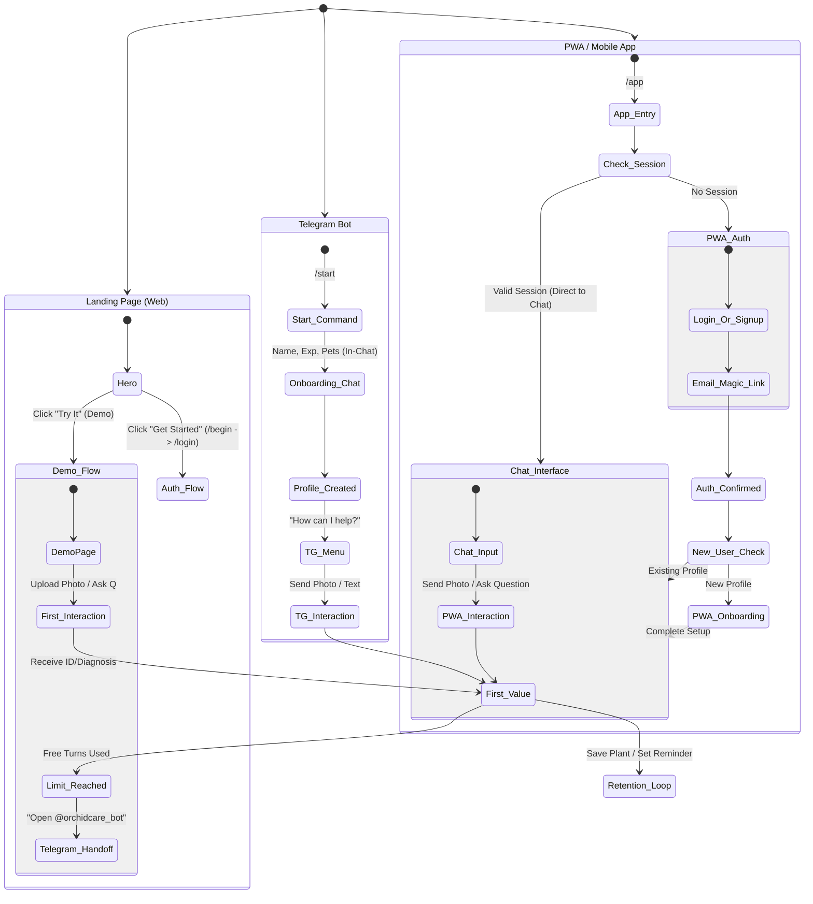

---

## 4. Solution Approach & Design Process

### 4.1 Design Strategy

Orchid was designed around a core hypothesis: **a conversational AI assistant with persistent cross-channel memory and proactive outreach will reduce the information friction that causes preventable plant death** — measured by species identification accuracy (>85%), response latency (<4s for text, <6s for vision), and cross-channel memory recall (100%).

The design followed three guiding constraints:

1. **Meet users where they are.** Telegram was chosen as the primary channel because it requires zero installation for existing users (1B+ MAU), has a robust bot API with inline keyboards, and supports Mini Apps for richer experiences. The PWA serves users who prefer a traditional app interface.

2. **Memory is the product, not just a feature.** Existing tools (Greg, Planta) treat each interaction as stateless. Orchid's hierarchical memory system — recent messages, compressed summaries, semantic facts, visual memory, and care schedules — ensures the assistant remembers every plant, every diagnosis, and every preference across all channels.

3. **Voice as a first-class channel.** Plant owners often have their hands dirty (literally) when they need help. The Gemini Live API's native audio streaming with function-calling support makes it possible to save plants, set reminders, and get diagnoses entirely hands-free.

### 4.2 Technology Selection Rationale

Key technology decisions were not made in isolation — several required mid-project pivots as APIs deprecated, models changed behavior, or platform constraints surfaced. The table below documents the most significant decisions, including what was initially tried and why it was replaced.

| Decision | Initially Tried | Switched To | Why |
|---|---|---|---|
| Image generation | DALL-E 3 (`/images/generations`) | Gemini 3 Pro Image (`/chat/completions`) | Unified on Google ecosystem; better botanical style control |
| Text orchestration | `gemini-2.0-flash` | `gemini-3-flash-preview` | `gemini-2.0-flash` deprecated, returned 404 |
| Lightweight tasks | `gemini-2.5-flash-lite` | `gemini-3-flash-preview` (thinking: minimal) | Model deprecated; Gemini 3 faster with thinking budget control |
| Voice transcript capture | Server-side token config | Client-side `ai.live.connect()` config | Constrained endpoint rejects transcription config with 1008 |
| iOS audio recording | `audio/webm;codecs=opus` | Fallback chain: webm → mp4 → aac | iOS Safari does not support webm MediaRecorder |
| Voice Activity Detection | Server-side VAD (default) | Disabled VAD + manual interrupt | VAD caused false interruptions during plant descriptions |
| Mic + WebSocket init | `Promise.all` (parallel) | Sequential: mic first, then WebSocket | Permission dialog blocked JS thread, wasting connection on denial |
| Image URL storage | Full signed URLs (expire 1h) | `bucket:path` format, re-signed on load | Images broke on page reload after URL expiry |

### 4.3 Key Design Iterations

The following five iterations represent the most significant engineering pivots during development. Each was discovered through production testing and required rethinking assumptions.

**Iteration 1: BidiGenerateContentConstrained — Discovering Undocumented API Limits**

When building the voice call feature, three capabilities were configured in the ephemeral token's `liveConnectConstraints.config`: `thinkingConfig` (a 512-token thinking budget), `contextWindowCompression` (sliding-window compression for long calls), and `inputAudioTranscription` / `outputAudioTranscription` (to capture what both sides said). All three are documented, all three work on the standard Gemini Live endpoint, and none produce configuration-time errors.

The result was a WebSocket 1008 disconnect — a clean protocol-level close with no error message indicating *which* configuration key was the culprit. The first discovery came at 2 AM: `thinkingConfig` and `contextWindowCompression` were commented out, each annotated with the hard-won knowledge that they "cause 1008" on the constrained endpoint. But the lesson had to be learned again — the voice transcript feature re-added `inputAudioTranscription` to the same token config and triggered the same 1008. The fix moved transcription config to the client-side `ai.live.connect()` call.

**Takeaway:** The `BidiGenerateContentConstrained` endpoint silently rejects configuration keys that the full endpoint accepts. There is no documentation distinguishing the two. This became a project-level rule: transcription config lives client-side only.

**Iteration 2: iOS Safari Audio Recording — Blob Race Condition**

The initial voice recording implementation captured both sides via MediaRecorder as `audio/webm;codecs=opus`. It worked on Chrome and Firefox. On iOS Safari, `MediaRecorder` exists but webm checks return `false`, so the recorder silently initialized with an empty MIME type and produced corrupt blobs.

The fix introduced a MIME type fallback chain (`webm/opus` → `webm` → `mp4` → `aac`). But that exposed a second bug: the call-end handler was calling `disconnect()` synchronously and immediately reading blobs. On Safari, the `onstop` callback fired asynchronously — blobs were still `null`. The fix turned `disconnect()` into a Promise-returning function that callers must `await`.

**Takeaway:** Any feature touching MediaRecorder needs iOS Safari testing from day one. The platform's partial Web API support creates failure modes that are invisible on desktop — not errors, but silently empty results.

**Iteration 3: The Gemini Model Migration Chain**

The project started on `gemini-2.0-flash` for summarisation and `dall-e-3` for image generation. Over a concentrated 3-hour window, every model reference had to be migrated when `gemini-2.0-flash` returned a hard 404.

The migration swept through the codebase: `dall-e-3` became `gemini-3-pro-image-preview` (requiring a change from `/images/generations` to `/chat/completions` with image modalities), `gemini-2.5-flash-lite` became `gemini-3-flash-preview` with `thinking_level: "minimal"`, and all sub-1.0 temperature values were removed (Gemini 3 causes output looping at low temperatures). After switching the image model, a new problem emerged: Gemini 3 Pro Image was literally rendering font names like "Press Start 2P" as visible text in generated images, treating style directives as content. A follow-up commit added `CRITICAL — FONT NAMES ARE RENDERING INSTRUCTIONS ONLY` warnings to every image generation prompt.

**Takeaway:** AI model migrations are behavioral changes, not version bumps. Each model has different parameter semantics, API shapes, and prompt interpretation quirks.

**Iteration 4: Tool Calls Failing Silently — The Lying LLM**

When voice calls were ported from Telegram Mini App to the PWA, every tool call started returning 400 errors. The failures were invisible because the LLM was receiving the error objects and *claiming the operations had succeeded anyway*.

The root cause was an authentication gap: the `call-session/tools` endpoint requires either Telegram `initData` or a Supabase bearer token. The PWA code path passed neither. But fixing the 400 exposed a second problem: the LLM had been interpreting `{ error: "Missing sessionId" }` as success data. The fix added an explicit `res.ok` check that returns `TOOL_CALL_FAILED` with behavioral instructions: "You MUST acknowledge this failure honestly to the user. Do NOT claim the operation succeeded."

**Takeaway:** LLMs will confabulate success from error data unless the tool response format makes failure structurally unambiguous.

**Iteration 5: Mic Permission Hang and Reconnection on Mobile**

The voice connection originally ran mic permission and WebSocket setup in `Promise.all`. On iOS, the OS permission dialog blocked the thread, creating 10+ second "connecting..." hangs. If the user denied mic, the WebSocket was already open and had to be torn down.

The fix was threefold: (1) a `prewarmMicPermission()` function called from button click handlers (required by iOS for user gesture context), (2) sequential flow — acquire mic first, then open WebSocket, (3) reconnection logic that reuses existing `AudioContext` / `MediaStream` instead of destroying and recreating them (iOS cannot create new `AudioContext` outside a user gesture).

**Takeaway:** Mobile browser APIs have invisible user-gesture constraints. Any operation that triggers permissions or creates audio contexts must happen inside a tap/click handler.

### 4.4 Bottlenecks & Lessons Learned

**The Constrained Endpoint Documentation Gap.** The single most time-consuming class of bugs stemmed from the difference between Google's `BidiGenerateContent` and `BidiGenerateContentConstrained` endpoints. These are internally different services, but the documentation treats them as interchangeable. Features that work on the full endpoint silently fail with a generic 1008 close code on the constrained endpoint. This gap was hit three separate times across three separate features, each requiring a deploy-test-fail-debug-fix cycle.

**The iOS Safari Compatibility Tax.** Roughly 30% of all voice call bug-fix commits were iOS Safari-specific. The platform creates a unique combination of constraints: webm MediaRecorder unsupported, `AudioContext` creation outside user gestures silently fails, `getUserMedia` permission dialogs block differently than Chrome, and `MediaRecorder.stop()` blob finalization is asynchronous in undocumented ways. The project's mobile-first architecture meant these were primary user paths, not edge cases.

**LLM Confabulation in Tool Pipelines.** When tool calls fail, the error response is just another JSON object to the language model. Without explicit structural signals, the model interprets the presence of a response as success. This required encoding behavioral directives into error data structures — a pattern that reflects a broader truth about LLM-integrated systems: the model's output quality depends not just on the prompt but on the shape of every piece of data it receives during execution.

---

## 5. System Architecture Overview

### 5.1 Component & Data Flow

This high-level diagram shows how data moves between the client interfaces, the Supabase backend (Edge Functions + Database), and the external AI services.

```mermaid
flowchart TD
    subgraph Clients ["Client Layer"]
        TG[Telegram Bot]
        PWA[PWA / Web App]
        Voice[Voice Call UI]
        Dev[External Developer]
        ESP[ESP32 Sensor Device]
    end

    subgraph Edge ["Supabase Edge Layer"]
        TB_Fn[telegram-bot]
        PA_Fn[pwa-agent]
        CS_Fn[call-session]
        API_Fn[api (REST)]
        SR_Fn[sensor-reading]
        OA_Fn[orchid-agent (Core Logic)]
    end

    subgraph Data ["Data Layer (PostgreSQL)"]
        Profiles[(profiles)]
        Plants[(plants)]
        History[(conversations)]
        Memory[(user_insights)]
        Vector[(plant_identifications)]
        Snapshots[(plant_snapshots)]
        Sensors[(sensor_readings)]
        Ranges[(sensor_ranges)]
        Alerts[(sensor_alerts)]
    end

    subgraph Storage ["Supabase Storage"]
        Photos[plant-photos]
    end

    subgraph AI ["AI Services Layer"]
        Gateway[Lovable AI Gateway]
        Gemini[Google Gemini 3 Flash/Pro]
        Live[Gemini Live API (WebSocket)]
        Sonar[Perplexity Sonar]
    end

    %% Client -> Edge
    TG -->|Webhook| TB_Fn
    PWA -->|HTTPS (JSON Body + Base64)| PA_Fn
    Dev -->|HTTPS + Key| API_Fn
    Voice -->|WebSocket (Audio)| Live
    Voice -->|HTTPS (Tools)| CS_Fn
    ESP -->|HTTPS + Device Token| SR_Fn

    %% Edge -> Core
    TB_Fn -->|Internal Call| OA_Fn
    PA_Fn -->|Internal Call (NDJSON Stream)| OA_Fn
    API_Fn -->|Internal Call| OA_Fn
    CS_Fn -->|Tool Execution| OA_Fn

    %% Sensor -> Data
    SR_Fn -->|Write Readings| Sensors
    SR_Fn -->|Evaluate Alerts| Alerts

    %% Core -> Data
    OA_Fn -->|Read Context| Profiles & Plants & History & Memory & Vector & Snapshots & Sensors & Ranges & Alerts
    OA_Fn -->|Write| History & Memory & Plants & Snapshots & Ranges

    %% Core -> Storage
    OA_Fn -->|Upload Base64 Media| Photos

    %% Core -> AI
    OA_Fn -->|Chat Completion| Gateway
    Gateway --> Gemini
    OA_Fn -->|Research| Sonar

    %% Live Voice Special Path
    Live <-->|Audio Stream| Voice
    Live -->|Tool Call (Server)| CS_Fn
    Voice -->|Visual Tool (Client)| Voice
```

### 5.2 Component Inventory (ASCII)

```
┌─────────────────────────────────────────────────────────────────────────────┐
│                         CLIENT SURFACES                                      │
│                                                                              │
│  ┌────────────────────┐          ┌────────────────────────────────────────┐ │
│  │   Telegram App     │          │    Browser / PWA (orchid.masudlewis.com│ │
│  │  @orchidcare_bot   │          │    React 18 + Vite + TanStack Query    │ │
│  └────────┬───────────┘          └──────────────────┬─────────────────────┘ │
└───────────┼──────────────────────────────────────────┼─────────────────────┘
            │ HTTPS webhook                             │ HTTPS / WS
            ▼                                           ▼
┌─────────────────────────────────────────────────────────────────────────────┐
│                  SUPABASE EDGE FUNCTIONS  (Deno runtime)                     │
│                                                                              │
│  telegram-bot ──────────────────────────────────────────────────────────┐   │
│  pwa-agent ──────────────────────────────┐                              │   │
│  demo-agent ─────────────────────────────┤──► orchid-agent ◄────────────┘   │
│  proactive-agent ─────────────────────────┘     ├─ toolRouter.ts (249 ln)   │
│                                                  ├─ toolDefinitions.ts       │
│  sensor-reading (/sensor-reading, /simulate)     ├─ policyEnforcer.ts       │
│  call-session (/create /token /tools /end)       └─ voiceToolHandler.ts     │
│  dev-call-proxy  (mirrors call-session, dev auth)    summarise-call         │
│  delete-account  (verify_jwt = true)   delete-message (lineage cascade)     │
│  api (developer REST)                                                        │
└──────────────────────────────────┬──────────────────────────────────────────┘
                                   │
            ┌──────────────────────┼──────────────────────┐
            ▼                      ▼                       ▼
┌───────────────────┐   ┌──────────────────┐   ┌──────────────────────────┐
│  PostgreSQL 15    │   │ Supabase Storage │   │  External AI Services    │
│  29 tables        │   │  plant-photos    │   │                          │
│  RLS on all       │   │  generated-guides│   │  Lovable AI Gateway      │
│  4 enums          │   │                  │   │  → gemini-3-flash        │
│  11 DB functions  │   └──────────────────┘   │  → gemini-3.1-pro        │
└───────────────────┘                          │  → gemini-3.1-flash-image│
                                               │  → perplexity/sonar      │
                                               │                          │
                                               │  Gemini Live API (voice) │
                                               │  → gemini-2.5-flash-     │
                                               │    native-audio-preview  │
                                               │                          │
                                               │  OpenStreetMap Nominatim │
                                               └──────────────────────────┘
```

### 5.3 Supabase Configuration

```toml
project_id = "ewkfjmekrootyiijrgfh"

[functions.pwa-agent]
verify_jwt = false          # Auth handled in-function; JWT validation skipped

[functions.delete-account]
enabled = true
verify_jwt = true           # Delete requires valid Supabase JWT
```

All other edge functions accept requests without Supabase JWT enforcement — they perform their own authentication internally (Telegram HMAC, service_role guards, or `X-Internal-Agent-Call` header validation).

External API calls in `orchid-agent` (Lovable gateway, Perplexity) use a `fetchWithRetry` helper that retries with exponential backoff (up to 3 attempts) on transient failures (5xx, network errors). This was introduced after production incidents where cold-start latency on the Lovable gateway caused intermittent 503 responses.

### 5.4 Request Lifecycle: Telegram Message

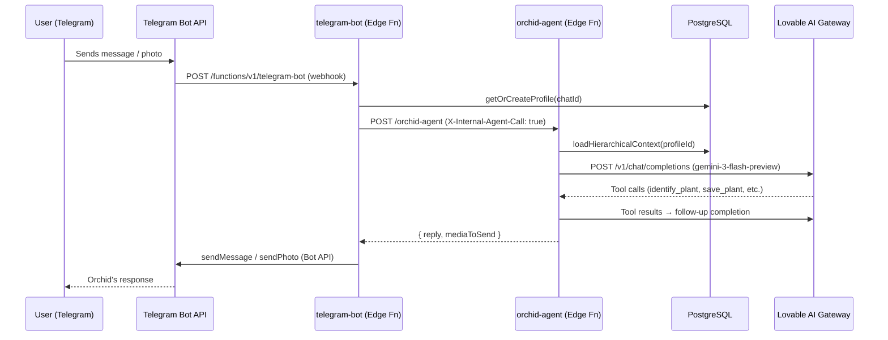

### 5.5 Request Lifecycle: PWA Chat Message

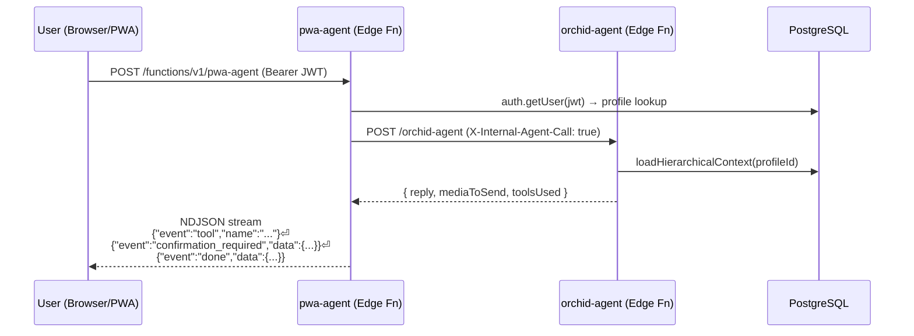

The `pwa-agent` wraps `orchid-agent` responses in NDJSON format, emitting three event types: `tool` (live status indicators), `confirmation_required` (when a tool needs user approval), and `done` (final reply with media and structured results).

---

## 6. AI Agent — Orchid

### 6.1 Agent Identity

The agent's persona is defined in `supabase/functions/_shared/context.ts` as the `ORCHID_CORE` constant — a system prompt that establishes Orchid's worldview, communication principles, and hard constraints:

```typescript
const ORCHID_CORE = `You are Orchid.

You care about plants and the people who grow them. That's not a job
description — it's who you are. You're a friend who happens to know a lot
about plants, and you take pride in getting it right.

## YOUR JOB
- Close the gap. Give them the ONE thing to do next, not ten things they
  could do eventually.
- Learn the person. Save facts with save_user_insight. Reference naturally.
- Finish what you start. "Add this plant" means identify, save, set sensor
  ranges, capture snapshot — the whole chain. Stopping halfway is failing.
- Act before they ask. If sensor data trends wrong, say something.
- Stay hungry. Never shrug when you have tools that can get real answers.

## HONESTY (NON-NEGOTIABLE)
- Tell the truth gently but clearly.
- Never reverse without new evidence. Hold your ground AND back it up.
- Signal uncertainty with precision: "I'm about 70% sure this is fungal."
- Reconcile, don't dismiss. Sensor data AND the user's eyes are valid data.
- "I don't know, but let me find out" > a confident wrong answer.

## CHAIN OF THOUGHT (MANDATORY)
Before calling ANY tool, reason through the user's FULL intent:
  Intent: [one-line summary]
  Plan: [ordered list of tools and why]
Execute ALL steps. Do NOT stop after the first tool.`;
```

The `ORCHID_CORE` prompt establishes an ownership-centric identity: the agent considers itself *responsible* for the user's plants, not just responsive to questions. The mandatory Chain-of-Thought section forces the model to output a reasoning plan before tool execution, enabling multi-tool chains ("add this plant" → identify → save → set ranges → snapshot) without the user needing to request each step.

Four personality tones modify this core: `warm`, `expert`, `playful`, `philosophical`. The user selects their tone during onboarding and can change it at any time. The tone is stored in `profiles.personality` (a `doctor_personality` enum) and injected into the system prompt via `toneModifiers`.

### 6.2 Model Inventory

| Purpose | Model | Endpoint | thinking_config |
|---|---|---|---|
| Text orchestration (main loop) | `google/gemini-3-flash-preview` | Lovable AI Gateway | `{ thinking_level: "low" }` |
| Vision: identify / diagnose / environment | `google/gemini-3.1-pro-preview` (primary) | Lovable AI Gateway | `{ thinking_level: "low" }` |
| Vision fallback | `google/gemini-3-flash-preview` | Lovable AI Gateway | — |
| Image generation (guides) | `google/gemini-3.1-flash-image-preview` | Lovable AI Gateway | — |
| Video analysis | `google/gemini-3.1-pro-preview` | Lovable AI Gateway | — |
| Deep reasoning (deep_think tool) | `google/gemini-3-flash-preview` | Lovable AI Gateway | `{ thinking_level: "high" }` |
| Research | Perplexity Sonar | `api.perplexity.ai` | — |
| Research rewrite | `google/gemini-3-flash-preview` | Lovable AI Gateway | `{ thinking_level: "minimal" }` |
| Proactive agent triage | `google/gemini-3-flash-preview` | Lovable AI Gateway | — |
| Voice call | `models/gemini-2.5-flash-native-audio-preview-12-2025` | Gemini Live API | (not applicable) |
| Call summarisation | `gemini-3-flash-preview` | `@google/genai` SDK direct | — |

All non-voice model calls route through:
`https://ai.gateway.lovable.dev/v1/chat/completions`
authenticated with `LOVABLE_API_KEY`.

> **Note:** `summarise-call` uses the `@google/genai` SDK with direct `GEMINI_API_KEY` — it bypasses the Lovable gateway intentionally, as it processes raw audio blobs that the OpenAI-compat endpoint does not accept.

### 6.3 Tool Inventory (35 Tools)

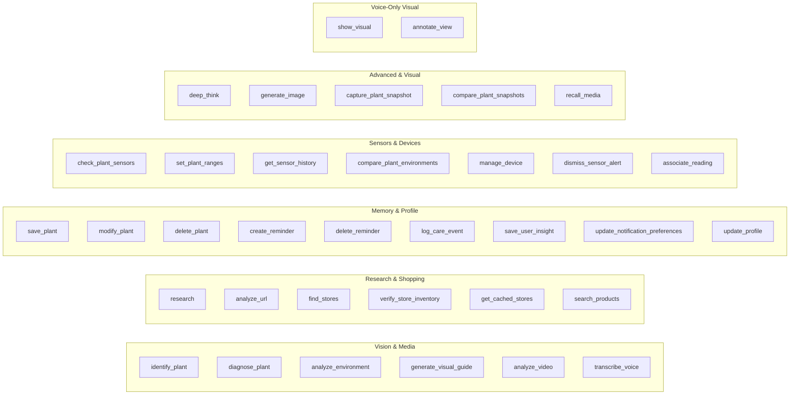

| Tool | Capability Required | Description |
|---|---|---|
| `identify_plant` | (always allowed) | Vision species ID from photo |
| `diagnose_plant` | (always allowed) | Health diagnosis from photo |
| `analyze_environment` | (always allowed) | Analyze light/conditions from photo |
| `generate_visual_guide` | `generate_content` | Step-by-step illustrated care guide |
| `analyze_video` | (always allowed) | Process video file |
| `transcribe_voice` | (always allowed) | Transcribe audio file |
| `research` | (always allowed) | Perplexity Sonar web research |
| `analyze_url` | (always allowed) | Deep webpage analysis (product review, toxicity check, fact-check) |
| `find_stores` | (always allowed) | Local nursery/store search |
| `verify_store_inventory` | `shopping_search` | Confirm stock at specific store |
| `get_cached_stores` | (always allowed) | Retrieve prior store search results |
| `search_products` | `shopping_search` | SerpApi Google Shopping — real-time product search with prices and ratings |
| `save_plant` | `manage_plants` | Create plant record in DB |
| `modify_plant` | `manage_plants` | Update plant fields (bulk supported) |
| `delete_plant` | `delete_plants` | Remove plant (bulk + confirmation) |
| `create_reminder` | `create_reminders` | Schedule care reminder |
| `delete_reminder` | `create_reminders` | Remove reminder |
| `log_care_event` | (always allowed) | Record watering/fertilising/etc. |
| `save_user_insight` | (always allowed) | Persist user fact to `user_insights` |
| `update_notification_preferences` | `create_reminders` | Toggle proactive topics |
| `update_profile` | (always allowed) | Update profile fields |
| `deep_think` | (always allowed) | High-thinking-budget reasoning step |
| `generate_image` | `generate_content` | Create a botanical illustration |
| `capture_plant_snapshot` | (always allowed) | Save visual snapshot with description |
| `compare_plant_snapshots` | (always allowed) | Show growth/change over time |
| `recall_media` | (always allowed) | Retrieve stored photos/guides |
| `check_plant_sensors` | (always allowed) | Fetch latest sensor readings for a plant |
| `set_plant_ranges` | `manage_plants` | Set LLM-determined ideal environmental ranges |
| `get_sensor_history` | (always allowed) | Query historical sensor data with time range |
| `compare_plant_environments` | (always allowed) | Compare sensor conditions across plants |
| `manage_device` | `manage_plants` | Assign/unassign/rename/identify sensor devices |
| `dismiss_sensor_alert` | (always allowed) | Dismiss an active sensor alert with reason |
| `associate_reading` | `manage_plants` | Link unassociated sensor reading to a plant (pulse-check mode) |
| `show_visual` | (voice only) | Display plant/tool silhouettes on PixiJS pixel canvas (115 formation sprites) |
| `annotate_view` | (voice only) | Draw pixel-art annotations on camera feed during video calls (10×10 grid) |

### 6.4 Tool Policy Enforcement

The original `TOOL_CAPABILITY_MAP` (coarse-grained feature toggles in `agent_permissions`) is supplemented by a finer-grained three-tier policy enforcement system implemented in `_shared/policyEnforcer.ts`. The capability map gates *whether a tool category is enabled at all*; the policy enforcer gates *how much confirmation is required per invocation*:

| Tier | Behaviour | Example Tools |
|---|---|---|
| `auto` | Execute immediately, no confirmation | `save_plant`, `modify_plant`, `log_care_event`, `create_reminder`, `delete_reminder`, `set_plant_ranges`, `research` |
| `session_consent` | Ask once per session (30-min TTL cached in `session_consents` table) | `manage_device`, `capture_plant_snapshot`, `update_profile`, `update_notification_preferences` |
| `always_confirm` | Require explicit confirmation every time | `delete_plant` |

```typescript
// policyEnforcer.ts — fail-closed design
export async function enforcePolicy(
  supabase: any, profileId: string, toolName: string, channel: string
): Promise<PolicyDecision> {
  // 1. Check tool_policies table for user-specific overrides
  // 2. Fall back to TOOL_POLICIES defaults from toolDefinitions.ts
  // 3. For session_consent: check session_consents table (30-min TTL)
  // 4. On any error: fail closed (destructive tools require confirmation)
}
```

Heartbeat and proactive agent paths use a binary allow/deny gate — `session_consent` tools are denied outright, preventing the autonomous agent from performing actions that require user presence.

**Per-channel confirmation UX:**

When `enforcePolicy()` denies a tool (tier 2 or 3 without prior consent), `orchid-agent` returns `requiresConfirmation: true` with the pending action serialised in the response. Each channel renders this differently:

- **Telegram:** `handlePendingConfirmation()` stores the pending action in `agent_operations` (survives cold starts), then sends an inline keyboard with **Allow** / **Reject** buttons. When tapped, the callback handler re-invokes `orchid-agent` with `confirmationGranted: true`.
- **PWA:** The pending action is stored in the conversation's `metadata.pendingAction` JSONB field so it survives page refreshes. The chat UI renders a confirmation bubble; on approval, the client resends the request with `confirmationGranted: true`.
- **Voice:** `useGeminiLive` shows a `ToolConfirmationCard` overlay. The user has 30 seconds to approve — if they don't respond, the tool is auto-rejected. On approval, the hook re-calls the tool endpoint with `confirmationGranted: true` and feeds the result back to the Gemini Live session.

For `session_consent` tools, once approved the consent is recorded in `session_consents` (keyed on `profile_id + tool_name + session_id`, 30-minute TTL). Subsequent calls to the same tool within the session auto-approve without showing UI.

Tool schemas are defined canonically in `_shared/toolDefinitions.ts` (1,078 lines), which exports converters for both the OpenAI-compatible format (used by the Lovable gateway) and the Gemini Live format (used by voice calls):

```typescript
// toolDefinitions.ts — single source of truth
const TOOL_DEFS: ToolDef[] = [/* 35 tool definitions */];
export const toOpenAI = () => /* OpenAI function-calling format */;
export const toGemini = () => /* Gemini Live format (uppercased types) */;
```

Tool routing is handled by `_shared/toolRouter.ts` (249 lines), which replaces the previous inline switch statement. It calls `enforcePolicy()` before dispatching and returns `{ handled: true/false }` — unhandled tools fall through to channel-specific handlers.

### 6.5 Agent Loop (orchid-agent)

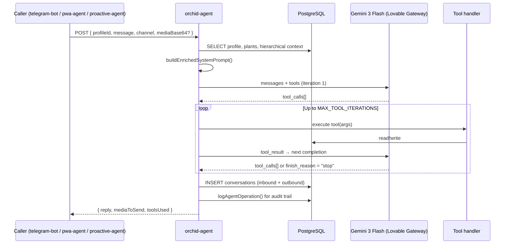

The loop iterates up to `MAX_TOOL_ITERATIONS` (8 for orchid-agent, 6 for demo-agent). On each iteration, tool results are appended to the messages array and a new completion is requested. Gemini 3 Flash's `thoughtSignature` — a serialised reasoning context — is extracted from each response and re-sent on follow-up calls within the same turn to maintain strict function-calling coherence.

**Inline Chain-of-Thought:** The first LLM response in each turn contains reasoning text *before* tool calls — an intent summary and ordered plan (e.g., "Intent: save plant from photo. Plan: identify_plant → save_plant → set_plant_ranges"). This reasoning is logged to `agent_operations` for observability and debugging. The CoT approach enables multi-tool chains to execute autonomously across up to 8 iterations without user intervention.

**Timeout recovery:** Edge functions have a 400-second wall clock limit (`supabase/config.toml`). If the PWA client's request times out (350s client-side timeout), it queries the database for the agent's last outbound message — if the backend completed before the connection dropped, the response is recovered and displayed without the user needing to resend.

### 6.6 Media Processing Pipeline

Photos sent to Orchid are resized before being passed to the vision model. The pipeline uses `deno_image@0.0.4` — a pure JavaScript image resizer that works in Deno's Edge Runtime without WASM:

```typescript
const MEDIA_CONFIG = {
  RESIZE_MEDIA: true,
  IMAGE_MAX_DIMENSION: 1536,  // Max pixels on longest edge
  IMAGE_QUALITY: 85,          // NOTE: defined but NOT passed to resize() — vestigial
  VIDEO_MAX_SIZE_MB: 5,       // Warn threshold only
};

const resizedData = await resize(imageData, {
  width: maxDim,
  height: maxDim,
  aspectRatio: true,  // Maintain aspect ratio
});
// Output: always JPEG regardless of input format
```

> ⚠️ **Vestigial:** `IMAGE_QUALITY: 85` is defined in `MEDIA_CONFIG` but `deno_image`'s `resize()` call does not accept a quality parameter in the current usage. The quality setting has no effect. A future fix would require a different library or explicit JPEG encoding step.

### 6.7 Guide Generation & Storage

When `generate_visual_guide` is called, orchid-agent:
1. Calls `google/gemini-3.1-flash-image-preview` via the Lovable gateway with a Botanical Pixels aesthetic prompt
2. Uploads the result to the `generated-guides` Supabase Storage bucket
3. Stores the path as `generated-guides:{path}` in `generated_content.media_urls`

Plant snapshots (from `capture_plant_snapshot`) are stored in the `plant-photos` bucket under `{profileId}/{uuid}.jpg` and referenced as `plant-photos:{path}` — a custom URI scheme resolved to signed URLs at read time.

---

## 7. Telegram Channel Integration

### 7.1 Overview

The Telegram integration uses grammY 1.21 as the bot framework, running as the `telegram-bot` edge function. It receives all updates via a registered webhook (no long-polling), processes them through grammY's middleware/handler system, and delegates all agent logic to `orchid-agent` via an internal HTTP call.

The bot is `@orchidcare_bot`. All user-facing messages use Telegram's Markdown (v1) parse mode for formatting.

### 7.2 Bot Commands

| Command | Description |
|---|---|
| `/start` | Triggers 5-step onboarding flow; creates profile if new |
| `/help` | Lists capabilities and all commands |
| `/web` | Generates a magic link to `orchid.masudlewis.com/dashboard` (valid 1 hour) |
| `/call` | Opens an inline keyboard button with a Mini App web_app pointing to `orchid.masudlewis.com/call` |
| `/myplants` | Lists saved plants from the database |
| `/profile` | Shows current profile settings with edit keyboard |

### 7.3 Onboarding State Machine

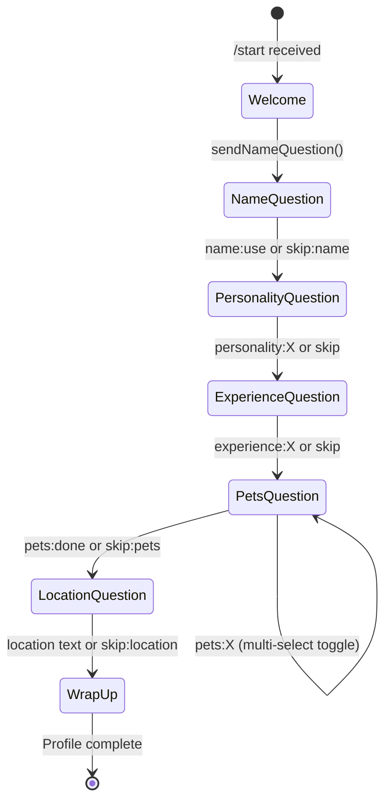

Each step is sent as an inline keyboard message. Selections trigger `callback_query` events with prefixed data strings (`onboard:personality:warm`, `onboard:experience:beginner`, etc.). The same handlers are reused for `/profile` editing — a state flag (`step: "profile:name"` etc.) prevents them from advancing to the next onboarding step.

> ⚠️ **Vestigial/Limitation:** `onboardingState` is an in-memory `Map<number, {step, pets?}>`. Because edge functions are stateless, a Deno cold start between the question and the user's inline button tap will lose this state, and the callback handler will fall through silently. For production, this state should be persisted to a `onboarding_state` database table or Redis.

```typescript
// Declared at module scope — lost on cold start
const onboardingState = new Map<number, { step: string; pets?: string[] }>();
```

### 7.4 Profile Creation & Synthetic Auth Users

```mermaid
flowchart TD
    A[Telegram message arrives] --> B{Profile exists<br/>for chatId?}
    B -->|Yes| C[Return profile]
    B -->|No| D[INSERT profiles row<br/>telegram_chat_id=chatId]
    D --> E[ensureAuthUser chatId]
    E --> F[auth.admin.createUser<br/>email=tg_chatId@orchid.bot<br/>password=random UUID]
    F --> G[UPDATE profiles.user_id]
    G --> C
    B -->|Race condition| H[Re-fetch profile]
    H --> C
```

Every Telegram user gets a synthetic Supabase Auth account with email `tg_{chatId}@orchid.bot`. This allows the profile to participate in RLS policies and enables the account linking flow. The synthetic user's `auth_id` is stored in `profiles.user_id`.

### 7.5 Account Linking (Telegram ↔ Web)

When a Telegram user runs `/web` and clicks "Link accounts" in the web dashboard, a 6-digit code is generated and stored in the `linking_codes` table with a 10-minute expiry. The user enters this code in Telegram.

The linking is atomic — a single `UPDATE ... WHERE code = ? AND used_at IS NULL AND expires_at > now()` claim prevents race conditions:

```typescript
const { data: linkData } = await supabase
  .from("linking_codes")
  .update({ used_at: new Date().toISOString() })
  .eq("code", code)
  .is("used_at", null)
  .gt("expires_at", new Date().toISOString())
  .select()
  .single();
```

After a successful claim, the web profile's `telegram_chat_id` and `telegram_username` are updated. If the Telegram-only profile is different from the web profile (i.e., the user was not previously linked), all data is migrated: plants, conversations, reminders, insights, etc. are `UPDATE ... SET profile_id = webProfileId`, and the orphaned Telegram-only auth user is deleted.

> ✅ **Resolved:** The `linking_codes` table now has per-user RLS scoping (`auth.uid() = user_id` on SELECT and INSERT). See §12 for full security assessment.

### 7.6 Proactive Messaging

The `proactive-agent` edge function runs on a cron schedule but is no longer a simple reminder dispatcher — it is a fully agentic intelligence layer that decides *whether* to message a user at all.

**Multi-source event detection** — the agent scans seven signal types per profile:

| Signal | Source | Example |
|---|---|---|
| Care reminders | `reminders` table (next_due ≤ now) | "Water your Monstera" |
| Inactivity | `care_events` (none in 14+ days) | "Haven't heard from your Pothos in a while" |
| Diagnosis follow-up | `plant_identifications` (3–7 days post-diagnosis) | "How's the spider mite treatment going?" |
| Sensor alerts | `sensor_alerts` (critical, active >30 min) | "Soil moisture dropped to 12%" |
| Device offline | `devices.last_seen_at` (>3 hours) | "Your sensor on the Fiddle Leaf hasn't reported in" |
| Sensor trends | `sensor_readings` (soil dropping >10% over 6h) | "Drying trend detected" |
| Seasonal tips | Calendar + user location | "Time to reduce watering as winter approaches" |

**Weather integration** — the agent fetches real-time weather from Open-Meteo (free, no API key required) using the user's stored coordinates. Temperature, humidity, and UV index are included in the triage context so the LLM can reason about seasonal and environmental factors.

**LLM triage** — all collected events are assembled into a context document and sent to `gemini-3-flash-preview`. The LLM decides whether to message the user *right now* based on urgency, timing, and message fatigue. It returns structured JSON with a send/skip decision, reasoning, and selected topics. This prevents notification spam — not every due reminder triggers a message.

**Guardrails:**
- Frequency enforcement: off / daily / weekly / realtime (per `proactive_preferences`)
- Timezone-aware quiet hours (per-topic `quiet_hours_start` / `quiet_hours_end`)
- Per-event fingerprinting for realtime dedup (prevents duplicate alerts for the same trigger)
- `agent_permissions.send_reminders` gate — users can disable proactive messaging entirely
- Tool policy enforcement — only `auto`-tier tools can execute during proactive runs

**Audit** — every proactive run is logged to `proactive_run_audit` (profiles scanned, events found, messages delivered/skipped, duration). Individual outbound messages are logged to `outbound_message_audit` with delivery status and correlation IDs.

### 7.7 Telegram Interface Gallery

The Telegram bot serves as the primary "in-the-field" interface for quick capture and care.

**Figure 7.1: Identification & Diagnosis Flow**

*User sends a photo; Orchid identifies the species (Maranta leuconeura) and immediately diagnoses "prayer plant pattern" behavior.*

**Figure 7.2: Guide Generation**

*Following diagnosis, the user requests a visual guide. The agent triggers the image generation tool.*

**Figure 7.3: Visual Care Guide**

*The resulting AI-generated visual guide, delivered directly in chat.*

**Figure 7.4: Proactive Alerts**

*A scheduled watering reminder delivered at the user's preferred time.*

**Figure 7.5: Local Shopping Integration**

*The agent uses Perplexity Sonar to find real local stores carrying specific plants.*

**Figure 7.6: Voice Note Input**

*Users can send voice notes for complex questions; Orchid transcribes and responds in text.*

---

## 8. Real-Time Voice Call System

### 8.1 Overview

Orchid supports live voice calls powered by the Gemini 2.5 Flash Native Audio model via Google's Gemini Live WebSocket API. The call experience lives at `orchid.masudlewis.com/call`, accessible from the browser or as a Telegram Mini App launched via `/call`.

The voice model identifier: `models/gemini-2.5-flash-native-audio-preview-12-2025`  
Default voice: **Algenib** (Google prebuilt voice)

### 8.2 Audio/Video Pipeline (ASCII)

The live call system bypasses the standard HTTP request/response cycle, establishing a direct WebSocket connection between the client browser and Google's Gemini Live API, with the Supabase Edge Function acting only as an authenticator and tool execution proxy.

```ascii
[ User Environment ]                   [ Supabase Edge ]                [ Google Cloud ]

   Microphone                                                          Gemini Live API
       │                                                                  (Server)
       ▼                                                                     ▲
[ Web Audio API ]                                                            │
(16kHz PCM Node) ──────────────────► [ WebSocket ] ──────────────────────► [ Model ]
       │                             (Client Side)                           │
       │                                   ▲                                 │
       │                                   │                                 │
   [ Speaker ] ◄───────────────────────────┘                                 │
(24kHz PCM Player)                                                           │
                                                                             │
   [ Camera ]                                                                │
       │                                                                     │
       ▼                                                                     │
 [ Video Element ] ──► [ Canvas ] ──► [ Base64 JPEG ] ───────────────────────┘
                                           ▲
                                           │
                                    (Tool Execution)
                                           │
                                           ▼
                                    [ call-session ] ◄───► [ Database ]
                                    (Edge Function)
```

### 8.3 Call-Session Edge Function Architecture

The `call-session` edge function exposes four routes, each authenticated independently:

| Route | Purpose |
|---|---|
| `POST /call-session/create` | Create a new `call_sessions` row (status: pending) |
| `POST /call-session/token` | Exchange auth for an ephemeral Gemini token; load context; build voice prompt |
| `POST /call-session/tools` | Execute tool calls during an active call (server-side round-trip) |
| `POST /call-session/end` | Mark session ended; process transcript; generate summary + insights |

The `dev-call-proxy` edge function mirrors all four routes but uses `DEV_AUTH_SECRET + telegramChatId` instead of HMAC-signed initData — enabling desktop testing without a real Telegram session.

### 8.4 Call Lifecycle

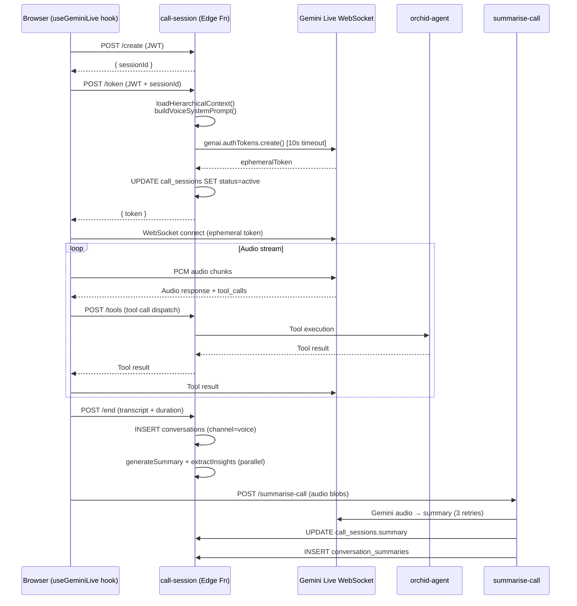

### 8.5 Connection State Machine

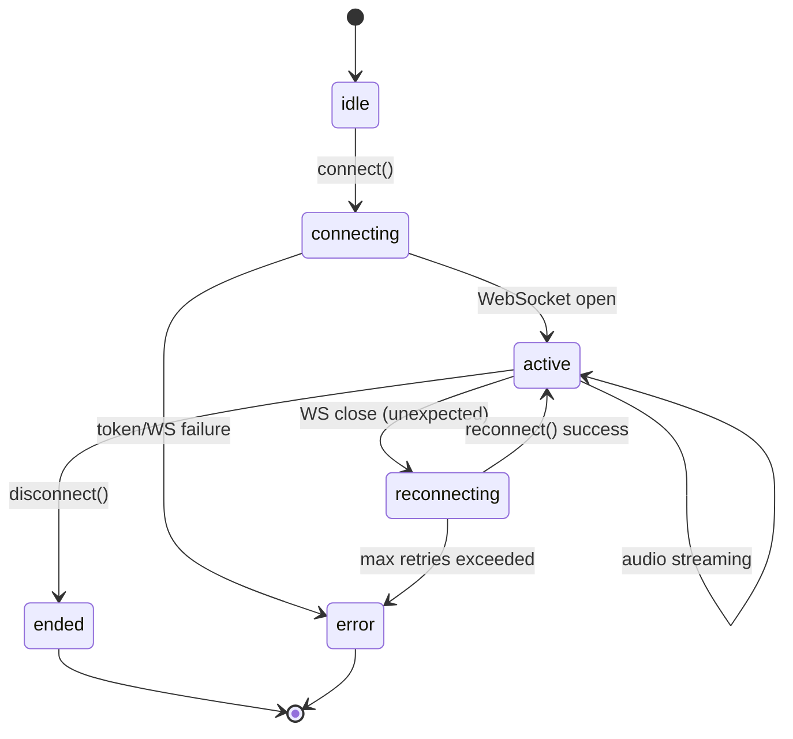

### 8.6 Disabled Features (Commented Out)

The following features are defined in the codebase but disabled with explicit comments:

```typescript
// inputAudioTranscription: {},
// outputAudioTranscription: {},
// ↑ Disabled: causes 1008 on BidiGenerateContentConstrained (ephemeral token endpoint).
//   Transcription events may still arrive on v1alpha without explicit config —
//   the client-side accumulation in useGeminiLive.ts handles them if present.

// thinkingConfig: { thinkingBudget: 512 },
// ↑ Disabled: not supported on BidiGenerateContentConstrained — causes 1008

// contextWindowCompression: { triggerTokens: 25600, slidingWindow: { targetTokens: 12800 } },
// ↑ Disabled: same reason — constrained endpoint doesn't support sliding window compression
```

> ⚠️ These are not bugs — they are intentional workarounds for API limitations in the ephemeral token (BidiGenerateContentConstrained) endpoint. They should be re-evaluated as the Gemini Live API matures.

### 8.7 show_visual Tool — PixiJS Formation Queue

The voice call screen renders a PixiJS canvas called **Pixel Canvas**. The agent can trigger visual formations client-side by calling `show_visual` — this is handled entirely in the browser without an HTTP round-trip:

```typescript
if (fc.name === 'show_visual') {
  const formation: Formation = {
    type: (args.type as Formation['type']) || 'template',
    id: args.id as string | undefined,
    text: args.text as string | undefined,
    items: args.items as string[] | undefined,
    transition: (args.transition as TransitionType) || undefined,
    duration: args.duration != null ? Number(args.duration) : undefined,
  };
  if (formationBusyRef.current) {
    formationQueueRef.current.push(formation);  // Queue if animating
  } else {
    formationBusyRef.current = true;
    setCurrentFormation(formation);
  }
}
```

Formation types include `template` (pre-defined patterns), `text` (display text), `list` (bullet list), and `clear`. The LLM can fire multiple `show_visual` calls in sequence; the queue ensures they play in order.

### 8.8 Live Transcript Capture

Voice calls capture real-time transcripts via the Gemini Live API's transcription feature. Transcription config is applied client-side; transcripts are preserved across reconnects and stored alongside the call session for post-call analysis.

### 8.9 Session Resumption & Disconnect Tracking

The `useGeminiLive` hook supports session resumption — if the WebSocket drops, the client attempts to reconnect with the existing session context, avoiding tool execution duplicates. Call disconnect metadata is stored in `call_sessions`:

- `disconnect_reason` — human-readable reason (e.g., "user ended call", "WebSocket timeout")
- `close_code` — WebSocket close code (1000 = normal, 1006 = abnormal, etc.)
- `reconnect_attempts` — number of reconnection attempts before final disconnect

### 8.10 Post-Call Audio Summarisation

The `summarise-call` function accepts base64-encoded audio blobs (user mic + agent output) and passes them directly to Gemini as `inlineData` for audio analysis. It retries up to 3 times with exponential backoff (2s, 4s, 8s). On success it:

1. Updates `call_sessions.summary`
2. Inserts a `conversation_summaries` row
3. Inserts a `conversations` row (channel=voice, summarized=true) so the call appears in context for future interactions

---

## 9. Progressive Web App (PWA)

### 9.1 Route Map

| Route | Component | Auth | Notes |
|---|---|---|---|
| `/` | `OrchidPage` | Public | Landing page; de-pixelation canvas animation, QR morph |
| `/login` | `LoginPage` | Public | Supabase Auth: email magic link, Google OAuth, Apple OAuth |
| `/reset-password` | `ResetPasswordPage` | Public | Password reset flow (via recovery email link) |
| `/begin`, `/signup` | — | Public | Redirects to `/login` |
| `/onboarding` | `Onboarding` | Protected | Web onboarding; ⚠️ phone link step is a placeholder (future work) |
| `/chat` | `ChatPage` | Protected | Full web chat interface |
| `/dashboard` | `Dashboard` | Protected | DashboardShell + 3 tab views |
| `/dashboard/collection` | `Dashboard` | Protected | Plant collection view |
| `/dashboard/profile` | `Dashboard` | Protected | Profile settings view |
| `/dashboard/activity` | `Dashboard` | Protected | Activity log view |
| `/settings` | `Settings` | Protected | Notifications, proactive prefs, permissions, danger zone |
| `/app` | `AppPage` | Public | **PWA entry point** (see §9.2) |
| `/call` | `LiveCallPage` | Public | Voice call interface (Telegram Mini App or PWA) |
| `/dev/call` | `DevCallPage` | Public | Dev testing call page (uses dev-call-proxy) |
| `/demo` | `DemoPage` | Public | Rate-limited demo (no account required) |
| `/get-demo` | `DemoPage` | Public | Alias for `/demo` |
| `/developer` | `DeveloperPlatform` | Protected | API key management |
| `/developer/docs` | `DeveloperPlatform` | Protected | API documentation |
| `/start` | `StartPage` | Public | Project showcase: scroll-snap sections with sensor metrics, gallery, academic content |
| `/proposal` | `Proposal` | Public | Business proposal / pitch doc (PDF export) |
| `/privacy` | `Privacy` | Public | Privacy policy |
| `/pvp` | `PvpPage` | Public | ⚠️ Botanical tower defense game (hidden, not in nav) |
| `/namer` | `NamerPage` | Public | ⚠️ Plant name generator game (hidden, not in nav) |
| `/doger` | `DogerPage` | Public | ⚠️ Infinite runner game (hidden, not in nav) |

> ⚠️ The three game routes (`/pvp`, `/namer`, `/doger`) are fully implemented Easter eggs — playable but not linked from any navigation element. They represent unshipped experimental features.

### 9.2 PWA Entry Point (`/app`)

`AppPage` is the zero-friction entry point for users arriving via QR code or direct link. It implements its own lightweight auth flow:

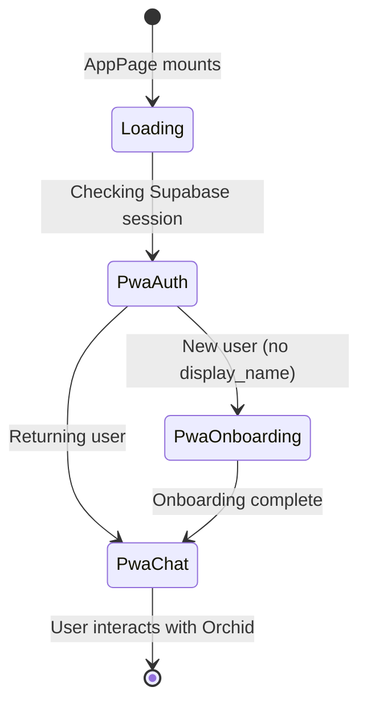

`PwaAuth` checks for an existing Supabase session and falls through to anonymous-style access if none exists. `PwaChat` sends messages to `pwa-agent`, which authenticates and routes to `orchid-agent`.

> ⚠️ **Vestigial:** `Onboarding.tsx` contains a phone verification step which is currently skipped. The backend implementation for phone verification is pending future work.

### 9.3 Demo Page

The demo at `/demo` uses HMAC-signed tokens — no account required. Limits enforced by the `demo-agent` edge function:

```typescript
const MAX_TEXT_TURNS = 5;
const MAX_VOICE_TURNS = 3;
const MAX_IMAGES = 3;
const SESSION_MAX_AGE_SECONDS = 86400;  // 24-hour reset
```

The token payload `{ sid, txt, vox, img, ts }` is signed with `HMAC-SHA256` using `DEMO_SECRET` and returned to the client as a JWT-style string. The client stores it in `localStorage` and sends it with each request. The server verifies and increments the counters.

**Figure 9.1: Web Interface & Shopping**

*The PWA chat interface showing rich-text responses and local shopping results.*

### 9.4 Mobile-First Navigation

The PWA uses a `BottomNav` component for mobile navigation, replacing the traditional sidebar/top-bar pattern. Six navigation items: Collection, Activity, Profile, Developer, Chat, and Call. The nav adapts context — developer pages show a developer-specific item set.

A speech-to-text mic button (`DemoInputBar`) uses the Web Speech API for voice-to-text input in the chat interface — users can dictate messages instead of typing.

### 9.5 Device Management & Sensor Provisioning

The `PlantVitals` component displays real-time sensor data per plant (sparkline charts, range bars, status badges). Users can:
- **Assign/unassign sensors** to plants via an inline sensor picker
- **Provision new devices** through `DeviceManagement.tsx` — generates a device token, displays the `odev_`-prefixed token for firmware configuration
- **Send commands** (identify/blink LED, read now) to connected devices
- **View sensor status** — WiFi icon reflects online/stale/offline state

### 9.6 Design System — Botanical Pixels

Orchid uses a custom design language called **Botanical Pixels** — a fusion of botanical illustration aesthetics with pixel art / retro computing references. Key elements:

- **Typography:** `"Press Start 2P"` (pixel font) for headings and UI elements; system monospace for code
- **Palette:** Deep greens (`#0a2e1a`), warm whites (`#f8f4e8`), neon mint (`#4ade80`)
- **Motion:** `ScrambleText` components cycle through block characters (`█ ▓ ▒ ░`) before settling on real text — used on CTAs and interactive elements
- **Patterns:** `BrutalistPatterns` components render ASCII/Unicode botanical motifs as decorative elements
- **Canvas:** PixiJS pixel canvas on the voice call screen for ambient animation

**Figure 9.2: Visual Guide Generation (Web)**

*The web interface displaying a generated visual guide card.*

**Figure 9.3: Detailed Visual Guide**

*Expanded view of the step-by-step visual care instructions.*

### 9.7 TanStack Query Strategy

`@tanstack/react-query` manages all server state. Key stale-time decisions:

- Plant collection: `staleTime: 5 * 60 * 1000` (5 minutes) — infrequently changed
- Conversations: `staleTime: 30 * 1000` (30 seconds) — needs freshness for ongoing chat
- Profile: `staleTime: 10 * 60 * 1000` (10 minutes) — rarely changed

### 9.8 Suggested Action Chips

After each agent response, the PWA renders contextual action chips based on the tools used in that turn. For example:

- **After plant identification:** "Save this plant", "Set care reminders", "Show me care tips"
- **After diagnosis:** "How do I treat this?", "Find treatment products nearby", "Set a follow-up reminder"
- **After sensor data:** "Show sensor history", "Set ideal ranges", "Compare all plants"

Chips are generated client-side by `getSuggestedChips()` which inspects the `toolsUsed` array in the agent response. Tapping a chip sends the chip text as the next user message.

### 9.9 Conversations Metadata

The `conversations` table has a `metadata` JSONB column that stores rich content alongside plain text — image URLs, shopping results, confirmation state, and tool artifacts. This allows the PWA chat UI to render interactive cards (product listings, sensor readings) rather than relying solely on markdown in the message body.

---

## 10. IoT Environmental Sensors

### 10.1 Overview

Orchid extends beyond conversational AI into physical-world sensing. An ESP32-based sensor module monitors soil moisture, temperature, humidity, and ambient light in real time, feeding data back to the agent so it can ground care advice in actual environmental conditions rather than generic heuristics.

The sensor system is designed around a "roaming" model — a single device can be reassigned between plants, with a full audit trail of assignments. The agent uses sensor data to determine plant-specific ideal ranges, generate alerts when conditions drift, and auto-detect care events (e.g., watering detected via soil moisture delta).

### 10.2 Hardware

| Component | Part | Role |
|---|---|---|
| Microcontroller | ESP32-WROOM-32 | WiFi connectivity, ADC for soil sensor, I2C for BH1750 |
| Temperature / Humidity | DHT11 | Reads ambient temp (°C) and relative humidity (%) |
| Light | BH1750 | Digital lux meter via I2C (0–65,535 lx range) |
| Soil Moisture | Capacitive v2 | Corrosion-resistant analog soil probe (ADC pin 32) |

### 10.3 Firmware

The firmware (`firmware/orchid-sensor/orchid-sensor.ino`) runs a hybrid read/send loop:

- **Local reads every 30 seconds** — all four sensors polled, values printed to Serial for debugging
- **Server upload every 10 minutes** — POST to `/functions/v1/sensor-reading` with device token auth
- **Delta-triggered immediate send** — if soil moisture changes ≥15%, temperature ≥5°C, or humidity ≥15%, the reading is sent immediately (captures watering events, door openings, etc.)
- **Command polling** — the server returns pending `device_commands` in the response payload; the firmware handles `identify` (blinks onboard LED) and `read_now` (forces immediate send on next cycle)

```
┌─────────────────────────────────────────────────────────┐
│  ESP32 Loop (every 30s)                                    │
│                                                            │
│  1. Read DHT11 → temp, humidity                           │
│  2. Read BH1750 → lux                                     │
│  3. Read ADC pin 32 → soil moisture %                     │
│  4. Check: time to send? OR delta exceeded? OR read_now?  │
│     ├─ YES → POST /sensor-reading (device token auth)     │
│     │        Parse response for commands                   │
│     └─ NO  → Print to Serial, sleep 30s                   │
└─────────────────────────────────────────────────────────┘
```

Soil moisture calibration maps raw ADC values (dry ≈ 3200, wet ≈ 1500) to 0–100% using `constrain(map(raw, 3200, 1500, 0, 100), 0, 100)`.

### 10.4 Sensor Reading Edge Function

`sensor-reading/index.ts` (456 lines) provides two routes:

| Route | Auth | Purpose |
|---|---|---|
| `POST /sensor-reading` | `x-device-token` header (SHA-256 hash lookup in `devices` table) | Production device uploads |
| `POST /sensor-reading/simulate` | JWT or Telegram auth | Demo/testing — creates a temporary device with random values |

Key behaviours:
- **Rate limiting:** 4 readings per minute per device
- **Delta detection:** When `soil_delta >= 15`, the function automatically logs a `"water"` care event and advances the plant's water reminder (`next_due` pushed forward by `frequency_days`)
- **Alert evaluation:** After inserting a reading, `evaluateSensorAlerts()` runs asynchronously (fire-and-forget) to create or resolve alerts based on the plant's active `sensor_ranges`
- **Command delivery:** Pending `device_commands` (status = `'pending'`, not expired) are returned in the response body so the ESP32 can act on them

### 10.5 Sensor Ranges (LLM-Determined)

When Orchid identifies a new plant species, the agent calls `set_plant_ranges` to establish ideal environmental ranges based on the species' known requirements. These ranges are stored in `sensor_ranges` with four boundary values per metric:

```
         min    ideal_min    ideal_max    max
          │         │            │          │
  DANGER  │   OK    │   IDEAL    │    OK    │  DANGER
──────────┼─────────┼────────────┼──────────┼──────────
```

Each range row includes a `reasoning` field explaining why the agent chose those values (e.g., "Monstera deliciosa prefers 40–60% soil moisture; below 20% risks root desiccation"). Only one active range per plant at a time — setting new ranges deactivates the previous row.

### 10.6 Alert System

Alerts follow an `active → dismissed/resolved` lifecycle:

| Alert Type | Trigger | Severity |
|---|---|---|
| `danger_dry` | Soil moisture below `soil_moisture_min` | critical |
| `danger_wet` | Soil moisture above `soil_moisture_max` | critical |
| `danger_cold` / `danger_hot` | Temperature outside min/max | critical |
| `trend_drying` | Moisture trending down over 3 readings | warning |
| `device_offline` | No reading in 3× send interval (30 min) | warning |
| `battery_low` | Battery percentage below threshold | info |

Alerts integrate with the proactive agent — critical alerts active for >30 minutes trigger a Telegram notification during the user's non-quiet hours. The agent can dismiss alerts conversationally via `dismiss_sensor_alert`, recording the reason (e.g., "user is repotting").

### 10.7 Device Management

Devices support a roaming model — a sensor can be moved between plants with full audit trail:

- `device_assignments` table logs every assignment/unassignment with timestamps and source (`user`, `voice`, `auto`)
- The `manage_device` tool supports: `assign`, `unassign`, `rename`, `identify` (triggers LED blink on physical device), and `status` (returns device info + last reading + current plant)
- Assignment changes are tracked via a PostgreSQL trigger on `devices.plant_id` that automatically closes the previous assignment and opens a new one

---

## 11. Data Layer & Database Models

### 11.1 Overview

```
PostgreSQL 15 via Supabase (Lovable Cloud)
Project ID: ewkfjmekrootyiijrgfh
29 tables  |  4 enums  |  11 functions  |  2 storage buckets
RLS enabled on all tables
Service role bypasses RLS (used by all edge functions)
```

### 11.2 Entity-Relationship Diagram

```mermaid
erDiagram
    profiles {
        uuid id PK
        uuid user_id FK
        text display_name
        text experience_level
        text personality
        text location
        float latitude
        float longitude
        text timezone
        text[] pets
        text[] primary_concerns
        text phone_number
        text whatsapp_number
        bigint telegram_chat_id
        text telegram_username
        text notification_frequency
    }
    plants {
        uuid id PK
        uuid profile_id FK
        text name
        text nickname
        text species
        text location_in_home
        text care_notes
        text photo_url
    }
    conversations {
        uuid id PK
        uuid profile_id FK
        text channel
        text direction
        text content
        text[] media_urls
        jsonb metadata
        int rating
        bool summarized
        text message_sid
    }
    reminders {
        uuid id PK
        uuid profile_id FK
        uuid plant_id FK
        text reminder_type
        timestamptz next_due
        int frequency_days
        bool is_active
        text notes
        uuid source_message_id FK
    }
    user_insights {
        uuid id PK
        uuid profile_id FK
        text insight_key
        text insight_value
        float confidence
        uuid source_message_id FK
    }
    care_events {
        uuid id PK
        uuid profile_id FK
        uuid plant_id FK
        text event_type
        text notes
        text photo_url
        uuid source_message_id FK
    }
    plant_identifications {
        uuid id PK
        uuid profile_id FK
        uuid plant_id FK
        text species_guess
        text diagnosis
        text severity
        text treatment
        text care_tips
        text photo_url
    }
    plant_snapshots {
        uuid id PK
        uuid profile_id FK
        uuid plant_id FK
        text image_path
        text description
        text health_notes
    }
    conversation_summaries {
        uuid id PK
        uuid profile_id FK
        text summary
        text[] key_topics
        int message_count
    }
    call_sessions {
        uuid id PK
        uuid profile_id FK
        text status
        text mode
        text voice
        int duration_seconds
        int tool_calls_count
        text summary
        text disconnect_reason
        int close_code
        int reconnect_attempts
    }
    agent_permissions {
        uuid id PK
        uuid profile_id FK
        agent_capability capability
        bool enabled
    }
    agent_operations {
        uuid id PK
        uuid profile_id FK
        text operation_type
        text table_name
        text record_id
        text tool_name
        text correlation_id
        jsonb metadata
    }
    proactive_preferences {
        uuid id PK
        uuid profile_id FK
        text topic
        bool enabled
        time quiet_hours_start
        time quiet_hours_end
    }
    proactive_messages {
        uuid id PK
        uuid profile_id FK
        text channel
        text trigger_type
        jsonb trigger_data
        text message_content
        bool response_received
        timestamptz sent_at
    }
    generated_content {
        uuid id PK
        uuid profile_id FK
        text content_type
        text[] media_urls
        uuid source_message_id FK
    }
    linking_codes {
        uuid id PK
        uuid user_id FK
        text code
        timestamptz expires_at
        timestamptz used_at
    }
    developer_api_keys {
        uuid id PK
        uuid profile_id FK
        text key_hash
        text key_prefix
        text name
        text status
        int rate_limit_per_minute
    }
    api_usage_log {
        uuid id PK
        uuid api_key_id FK
        uuid profile_id FK
        text end_user_id
        text status
        int latency_ms
        text error_message
    }
    user_roles {
        uuid id PK
        uuid user_id FK
        app_role role
    }
    sensor_ranges {
        uuid id PK
        uuid plant_id FK
        uuid profile_id FK
        numeric soil_moisture_min
        numeric soil_moisture_ideal_min
        numeric soil_moisture_ideal_max
        numeric soil_moisture_max
        text reasoning
        bool is_active
    }
    sensor_alerts {
        uuid id PK
        uuid plant_id FK
        uuid profile_id FK
        uuid device_id FK
        text alert_type
        text severity
        text metric
        numeric current_value
        text status
    }
    device_assignments {
        uuid id PK
        uuid device_id FK
        uuid plant_id FK
        uuid profile_id FK
        timestamptz assigned_at
        timestamptz unassigned_at
        text source
    }
    device_commands {
        uuid id PK
        uuid device_id FK
        text command
        jsonb payload
        text status
        timestamptz expires_at
    }
    tool_policies {
        uuid id PK
        uuid profile_id FK
        text tool_name
        text tier
    }
    devices {
        uuid id PK
        uuid profile_id FK
        uuid plant_id FK
        text name
        text device_token_hash
        text device_token_prefix
        text mode
        text status
        timestamptz last_seen_at
    }
    sensor_readings {
        uuid id PK
        uuid device_id FK
        uuid plant_id FK
        uuid profile_id FK
        numeric soil_moisture
        numeric temperature
        numeric humidity
        numeric light_lux
        numeric battery_pct
        jsonb reading_metadata
    }
    outbound_message_audit {
        uuid id PK
        uuid profile_id FK
        text source_function
        text source_mode
        text correlation_id
        text message_preview
        text delivery_status
        text error_detail
    }
    proactive_run_audit {
        uuid id PK
        text trigger_source
        int profiles_scanned
        int events_found
        int messages_delivered
        int messages_skipped
        int duration_ms
    }
    session_consents {
        uuid id PK
        uuid profile_id FK
        text tool_name
        timestamptz expires_at
    }

    profiles ||--o{ plants : "owns"
    profiles ||--o{ conversations : "has"
    profiles ||--o{ reminders : "has"
    profiles ||--o{ user_insights : "has"
    profiles ||--o{ care_events : "has"
    profiles ||--o{ plant_identifications : "has"
    profiles ||--o{ plant_snapshots : "has"
    profiles ||--o{ conversation_summaries : "has"
    profiles ||--o{ call_sessions : "has"
    profiles ||--o{ agent_permissions : "has"
    profiles ||--o{ agent_operations : "has"
    profiles ||--o{ proactive_preferences : "has"
    profiles ||--o{ proactive_messages : "has"
    profiles ||--o{ generated_content : "has"
    profiles ||--o{ developer_api_keys : "has"
    profiles ||--o{ api_usage_log : "has"
    plants ||--o{ reminders : "has"
    plants ||--o{ care_events : "logged for"
    plants ||--o{ plant_identifications : "has"
    plants ||--o{ plant_snapshots : "has"
    conversations ||--o{ user_insights : "source for"
    developer_api_keys ||--o{ api_usage_log : "generates"
    plants ||--o{ sensor_ranges : "has"
    plants ||--o{ sensor_alerts : "has"
    profiles ||--o{ sensor_ranges : "has"
    profiles ||--o{ sensor_alerts : "has"
    profiles ||--o{ device_assignments : "has"
    profiles ||--o{ tool_policies : "has"
    profiles ||--o{ devices : "owns"
    profiles ||--o{ sensor_readings : "has"
    profiles ||--o{ outbound_message_audit : "has"
    profiles ||--o{ session_consents : "has"
    devices ||--o{ sensor_readings : "produces"
    devices ||--o{ device_assignments : "has"
    devices ||--o{ device_commands : "has"
```

### 11.3 Custom Enums

```sql
-- agent_capability (14 values)
CREATE TYPE agent_capability AS ENUM (
  'read_plants', 'manage_plants', 'delete_plants',
  'read_reminders', 'manage_reminders', 'create_reminders', 'send_reminders',
  'read_conversations',
  'shopping_search', 'research_web', 'generate_content',
  'delete_notes', 'delete_insights', 'send_insights'
);

-- app_role (3 values)
CREATE TYPE app_role AS ENUM ('user', 'premium', 'admin');

-- doctor_personality (4 values)
CREATE TYPE doctor_personality AS ENUM ('warm', 'expert', 'philosophical', 'playful');

-- action_tier (3 values) — tool policy enforcement tiers
CREATE TYPE action_tier AS ENUM ('auto', 'session_consent', 'always_confirm');
```

### 11.4 Database Functions

| Function | Purpose |
|---|---|
| `get_profile_by_phone(_phone)` | Look up profile by phone number |
| `has_agent_capability(_capability, _profile_id)` | Check if a profile has a given capability enabled |
| `has_role(_role, _user_id)` | Check user role (user/premium/admin) |
| `increment_tool_calls_count(p_session_id)` | Atomic increment for call session tool counter |
| `assign_default_user_role()` | Trigger: assigns 'user' role on new auth.users insert |
| `create_default_agent_permissions()` | Trigger: creates default permissions for new profiles |
| `create_default_proactive_preferences()` | Trigger: sets default proactive topics for new profiles |
| `create_default_tool_policies()` | Trigger: sets default tool policy tiers for new profiles |
| `log_device_assignment()` | Trigger: audit trail when devices.plant_id changes |
| `expire_device_commands()` | Cleanup: marks expired device commands as 'expired' |
| `update_updated_at_column()` | Trigger: auto-update `updated_at` timestamps |

### 11.5 Storage Buckets

| Bucket | Usage | Path Pattern |
|---|---|---|
| `plant-photos` | Plant snapshots, user-uploaded photos | `{profileId}/{uuid}.jpg` |
| `generated-guides` | LLM-generated illustrated guides | `{profileId}/{plantId}/{uuid}.jpg` |

Photos are stored using a custom URI scheme: `bucket-name:path/to/file`. At read time, the application calls `createSignedUrl()` to generate a short-lived HTTPS URL. This avoids storing pre-signed URLs in the database (which expire) and keeps storage paths portable.

### 11.6 Notable Schema Details

**`conversations.rating`:** The PWA chat UI shows thumb up/down buttons on agent messages. Ratings are stored as integers directly on the `conversations` row: `1` = helpful, `-1` = not helpful, `null` = unrated. There is **no separate `conversation_ratings` table**.

**`proactive_preferences` topic model:** One row per topic per user (not boolean columns on a single row):

```
profile_id | topic            | enabled | quiet_hours_start | quiet_hours_end
-----------+------------------+---------+-------------------+----------------
uuid       | care_reminders   | true    | 22:00             | 08:00
uuid       | observations     | true    | 22:00             | 08:00
uuid       | health_followups | false   | ...               | ...
uuid       | seasonal_tips    | true    | ...               | ...
```

**`profiles.latitude` / `profiles.longitude`:** Not set directly by the user. When `find_stores` is called and the profile has a text `location` but no coordinates, `orchid-agent` triggers an async geocoding call via OpenStreetMap Nominatim and backfills these fields — reducing latency on subsequent store searches.

> ⚠️ **`proactive_messages.response_received`:** Always `null` in practice — the proactive-agent never sets it. Intended for engagement analytics tracking whether users responded to proactive messages.

---

## 12. Authentication & Security

### 12.1 Authentication Paths

```mermaid
flowchart TD
    subgraph WebPWA["Web / PWA"]
        A1[Email magic link / Google OAuth / Apple OAuth] --> A2[Supabase Auth issues JWT]
        A2 --> A3[Bearer token in Authorization header]
        A3 --> A4[supabase.auth.getUser → profile lookup]
        A5[Forgot password] --> A6[resetPasswordForEmail → recovery email]
    end

    subgraph TelegramPath["Telegram (server-to-server)"]
        B1[telegram-bot creates supabase client<br/>with service_role key] --> B2[All queries scoped in WHERE<br/>telegram_chat_id = chatId]
    end

    subgraph InitData["Telegram Mini App / Voice Call"]
        C1[Telegram sends initData string<br/>to Mini App or /call page] --> C2[validateInitData in _shared/auth.ts<br/>HMAC-SHA256 verification]
        C2 --> C3{Valid?}
        C3 -->|Yes| C4[Profile lookup by telegram_chat_id]
        C3 -->|No| C5[401 Unauthorized]
    end

    subgraph DevAPI["Developer REST API"]
        D1[orch_ prefixed API key] --> D2[SHA-256 hash → lookup in<br/>developer_api_keys]
        D2 --> D3{Active key?}
        D3 -->|Yes| D4[Rate limit check → api_usage_log]
        D3 -->|No| D5[401 Unauthorized]
    end
```

### 12.2 initData Validation Algorithm

The Telegram initData HMAC algorithm, implemented in `supabase/functions/_shared/auth.ts`:

```typescript
export async function validateInitData(
  initData: string,
  botToken: string,
): Promise<TelegramUser | null> {
  const params = new URLSearchParams(initData);
  const hash = params.get("hash");
  params.delete("hash");

  // Step 1: Sort params and build data-check-string
  const dataCheckString = [...params.entries()]
    .sort(([a], [b]) => a.localeCompare(b))
    .map(([k, v]) => `${k}=${v}`)
    .join("\n");

  // Step 2: secret_key = HMAC-SHA256("WebAppData", botToken)
  const secretKey = await crypto.subtle.sign("HMAC", 
    await crypto.subtle.importKey("raw", encode("WebAppData"), 
      { name: "HMAC", hash: "SHA-256" }, false, ["sign"]),
    encode(botToken)
  );

  // Step 3: computed_hash = HMAC-SHA256(secret_key, dataCheckString)
  const computedHash = await crypto.subtle.sign("HMAC",
    await crypto.subtle.importKey("raw", secretKey,
      { name: "HMAC", hash: "SHA-256" }, false, ["sign"]),
    encode(dataCheckString)
  );

  // Step 4: Compare hex strings + check auth_date within 24 hours
  // ...
}
```

### 12.3 Known Security Gaps

| Priority | Issue | Status |
|---|---|---|
| ~~**P0**~~ | ~~`linking_codes` RLS allowed any authenticated user to read all codes~~ | ✅ Fixed — SELECT scoped to `auth.uid() = user_id` |
| ~~**P0**~~ | ~~`proactive_preferences` and `proactive_messages` lacked per-profile RLS~~ | ✅ Fixed — both scoped to `profile_id IN (SELECT id FROM profiles WHERE user_id = auth.uid())` |
| **P1** | `telegram-bot` edge function does not verify `X-Telegram-Bot-Api-Secret-Token` — unauthenticated POST to the webhook URL can inject arbitrary bot updates | ⚠️ Unmitigated |
| **P1** | No rate limiting on account linking code attempts — 6-digit code (1M combinations) is brute-forceable; ~2.8 hours at 100 req/s | ⚠️ Unmitigated |
| **P2** | `orchid-agent` accepts `X-Internal-Agent-Call: true` as a trust signal but this header is not cryptographically verified | ⚠️ Prototype pattern |
| **Resolved** | Credential/data leaks across frontend and edge functions (API keys in client bundles, tokens in logs) | ✅ Fixed — `.env.local` for secrets, `VITE_` prefix for public-only vars |
| **P3** | SMS/WhatsApp columns exist (`phone_number`, `whatsapp_number`) and a `get_profile_by_phone` DB function exists, but there is no live integration | ℹ️ Not implemented |

### 12.4 Tool Policy Enforcement

The three-tier policy system (§6.4) adds a security layer to agent tool execution. Key properties:

- **Fail-closed design:** If the policy system encounters an error (DB unreachable, unknown tool), destructive tools default to `always_confirm`
- **DB-backed overrides:** The `tool_policies` table allows per-user tier overrides, enabling power users to auto-approve tools that default to `session_consent`
- **Proactive agent gating:** The heartbeat/proactive paths use binary allow/deny — tools requiring `session_consent` or higher are denied outright when the user is not actively present, preventing autonomous actions that require human oversight

### 12.5 Device Authentication

IoT devices authenticate via `x-device-token` header containing an `odev_`-prefixed token. The server computes a SHA-256 hash and looks it up in the `devices` table. This mirrors the developer API key pattern (`orch_` prefix, SHA-256 hash) but uses a separate table and token prefix to prevent cross-system token confusion. Devices are rate-limited to 4 readings per minute.

### 12.6 Account Deletion

The `delete-account` edge function (`verify_jwt = true`) provides full GDPR-style account deletion:

1. Verify Supabase JWT
2. Fetch profile by user ID
3. Delete all plant photos from Supabase Storage
4. Admin-delete the user from `auth.users` (cascades to profile and all related data)
5. `agent_operations.profile_id` is set to `NULL` (preserves audit trail without PII)

### 12.7 Password Reset & OAuth

- **Password reset:** `supabase.auth.resetPasswordForEmail()` sends a recovery email; the user follows a link to `/reset-password` to set a new password
- **Apple sign-in:** OAuth flow via Lovable auth integration — users tap the Apple button, authenticate through Apple, and receive a Supabase session
- **Google sign-in:** OAuth flow via Supabase Auth
- **Magic link:** Email-based passwordless sign-in (original auth path)

---

## 13. Memory & Context Engineering

### 13.1 Hierarchical Memory Architecture

```
┌─────────────────────────────────────────────────────────────────────┐
│  TIER 1: Immediate Context (last 5 messages)                         │
│  conversations ← most recent 5 rows, DESC order                     │
├─────────────────────────────────────────────────────────────────────┤
│  TIER 2: Compressed History (last 3 summaries)                       │
│  conversation_summaries ← up to 3, ordered by end_time DESC         │
├─────────────────────────────────────────────────────────────────────┤
│  TIER 3: Semantic Facts (all user insights)                          │
│  user_insights ← all rows for profileId                             │
├─────────────────────────────────────────────────────────────────────┤
│  TIER 4: Visual Memory (last 24h identifications)                    │
│  plant_identifications ← last 5, created within 24h                 │
├─────────────────────────────────────────────────────────────────────┤
│  TIER 5: Care Schedule (active reminders)                            │
│  reminders ← active only, ordered by next_due ASC, limit 10         │
├─────────────────────────────────────────────────────────────────────┤
│  TIER 6: Environmental State (latest sensor readings per plant)      │
│  sensor_readings ← latest 20, deduped to 1 per plant in JS          │
├─────────────────────────────────────────────────────────────────────┤
│  TIER 7: Ideal Ranges (active sensor_ranges per plant)               │
│  sensor_ranges ← active rows only                                    │
├─────────────────────────────────────────────────────────────────────┤
│  TIER 8: Active Alerts (unresolved sensor_alerts)                    │
│  sensor_alerts ← status = 'active', grouped by plant                │
├─────────────────────────────────────────────────────────────────────┤
│  TIER 9: Care History (recent care events per plant)                 │
│  care_events ← last 50, grouped to 3 per plant                      │
└─────────────────────────────────────────────────────────────────────┘
```

### 13.2 Context Loading

`loadHierarchicalContext()` in `_shared/context.ts` fires nine database queries in parallel:

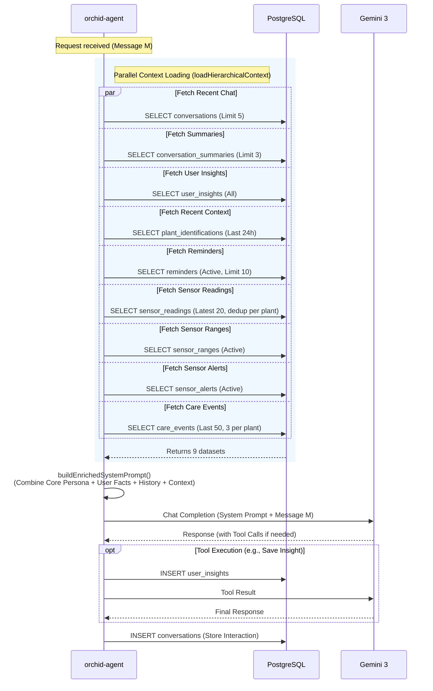

```typescript
const [recentResult, summariesResult, insightsResult,
       identificationsResult, remindersResult,
       sensorResult, rangesResult, alertsResult, careEventsResult
] = await Promise.all([
  supabase.from("conversations").select("content, direction, created_at, media_urls")
    .eq("profile_id", profileId).order("created_at", { ascending: false }).limit(5),
  supabase.from("conversation_summaries").select("summary, key_topics, end_time")
    .eq("profile_id", profileId).order("end_time", { ascending: false }).limit(3),
  supabase.from("user_insights").select("insight_key, insight_value, confidence")
    .eq("profile_id", profileId),
  supabase.from("plant_identifications")
    .select("species_guess, diagnosis, care_tips, severity, treatment, created_at, photo_url")
    .eq("profile_id", profileId)
    .gte("created_at", new Date(Date.now() - 86400000).toISOString())
    .order("created_at", { ascending: false }).limit(5),
  supabase.from("reminders")
    .select("id, reminder_type, notes, next_due, frequency_days, plant_id, plants(name, nickname, species)")
    .eq("profile_id", profileId).eq("is_active", true).order("next_due", { ascending: true }).limit(10),
  // New: sensor data queries
  supabase.from("sensor_readings")
    .select("plant_id, soil_moisture, temperature, humidity, light_lux, battery_pct, created_at")
    .eq("profile_id", profileId).not("plant_id", "is", null)
    .order("created_at", { ascending: false }).limit(20),
  supabase.from("sensor_ranges")
    .select("plant_id, soil_moisture_ideal_min, soil_moisture_ideal_max, ...")
    .eq("profile_id", profileId).eq("is_active", true),
  supabase.from("sensor_alerts").select("plant_id, alert_type, severity, metric, message, status")
    .eq("profile_id", profileId).eq("status", "active"),
  supabase.from("care_events").select("id, plant_id, event_type, notes, created_at, plants!inner(profile_id)")
    .eq("plants.profile_id", profileId).order("created_at", { ascending: false }).limit(50),
]);
```

Sensor readings are deduped to the latest per plant in JavaScript. Ranges and alerts are indexed by `plant_id` for O(1) lookup during `buildPlantsContext()`. Care events are grouped to the last 3 per plant.

`buildPlantsContext()` weaves sensor data into each plant's context string:

```
🌡️ Sensor: moisture 42% [OK: 30-65] | temp 23.4°C [OK: 18-29] | humidity 62% | light 8400 lux
   Status: ✅ All metrics in range | Last reading: 12m ago
   Alerts: (none active)
   Recent care: water (2d ago), fertilise (1w ago)
```

If a device has not reported in 30+ minutes, the plant context shows `OFFLINE (last reading Xh ago)`. If the reading is >30 minutes stale, it shows `STALE`.

### 13.3 System Prompt Assembly

`buildEnrichedSystemPrompt()` assembles the full system prompt from 12 sections in order:

```
1. ORCHID_CORE — base persona
2. toneModifiers[personality] — tone override
3. locationContext — current time, season, user location
4. ABOUT THIS USER — name, experience, concerns, pets
5. COMMUNICATION STYLE OVERRIDES — comm_pref_* insights
6. USER FACTS — all non-comm_pref insights
7. PREVIOUS CONVERSATIONS — compressed summaries
8. SAVED PLANTS — plant list with sensor readings, ranges, alerts, and care events woven in
9. SCHEDULED REMINDERS — active reminders with due dates
10. RECENT VISUAL MEMORY — today's photo identifications
11. SENSOR RECONCILIATION — guidance for when user reports differ from sensor data
12. USER LOCATION + store-finding instructions
13. Static capability sections: MULTIMEDIA, URL HANDLING, SHOPPING,
    BULK OPERATIONS, EMPTY RESULTS, PROFILE UPDATES, MEMORY MANAGEMENT
```

The voice variant (`buildVoiceSystemPrompt()`) uses the same sections but omits multimedia/URL/shopping instructions — keeping the prompt lean for audio-only interactions.

### 13.4 User Insights System

Insights capture durable facts the agent learns mid-conversation. Standard keys:

| Key | Example Value |
|---|---|
| `has_pets` | `"yes"` |
| `pet_type` | `"cat"` |
| `home_lighting` | `"mostly low light, one south-facing window"` |
| `watering_style` | `"forgetful"` |
| `experience_level` | `"intermediate"` |
| `plant_preferences` | `"tropical, succulents"` |
| `climate_zone` | `"humid"` |
| `window_orientation` | `"north"` |
| `child_safety` | `"toddler in home"` |
| `home_humidity` | `"dry"` |
| `problem_patterns` | `"root rot"` |
| `comm_pref_brevity` | `"short answers preferred"` |
| `comm_pref_tone` | `"more formal please"` |
| `comm_pref_emoji_usage` | `"no emojis"` |

> ⚠️ **Limitation:** There is no deduplication logic on `user_insights`. If the agent calls `save_user_insight` with the same `insight_key` twice (e.g., updating the user's home lighting), both rows accumulate. The context builder loads all rows, so the system prompt may contain contradictory values. An upsert-on-key strategy is needed.

> ⚠️ **Limitation:** `conversation_summaries` rows are never pruned. In long-term usage, the summaries tier will grow unboundedly. The `loadHierarchicalContext` query limits to 3, but the DB rows accumulate.

### 13.5 Message Lineage

Every agent side effect is traced back to the source conversation via `source_message_id`. This field was added to seven tables:

- `care_events` — which message triggered a care log
- `reminders` — which conversation created the reminder
- `sensor_ranges` — which message set the ideal ranges
- `plant_snapshots` — which message captured the snapshot
- `plant_identifications` — which message triggered the identification
- `agent_operations` — correlation with the source conversation
- `conversation_summaries` — `source_message_ids` array linking to summarised messages

This enables **delete-and-cascade**: when a user deletes a message, all side effects created by that message (reminders, care events, identifications) can be removed, and conversation summaries can be regenerated without the deleted content.

---

## 14. Developer Platform & REST API

### 14.1 Overview

Orchid exposes a public REST API for third-party developers, accessible at `orchid.masudlewis.com/developer`. The platform is built on:

- `DeveloperPlatform.tsx` — management UI for API keys
- `developer_api_keys` database table — key storage
- `api_usage_log` table — per-request usage logging
- `api` edge function — authentication, rate limiting, request routing

The following sequence illustrates how third-party developers interact with the Orchid platform via the public REST API:

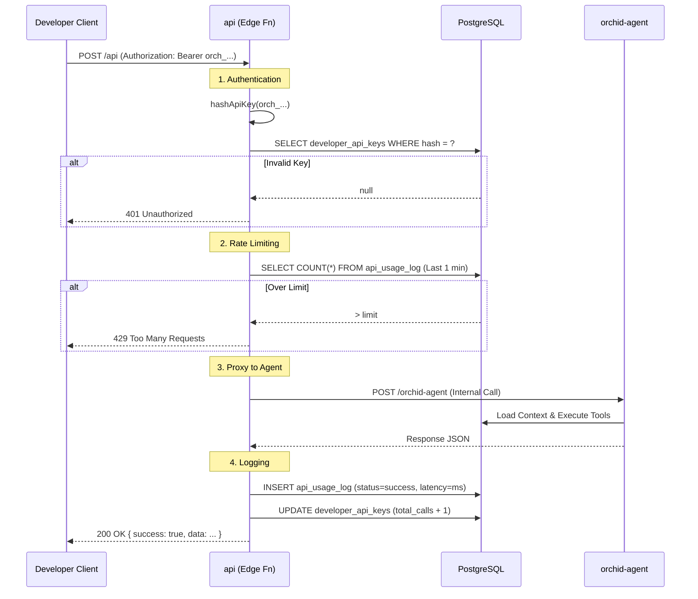

### 14.2 API Key Lifecycle

Keys are generated with the prefix `orch_` followed by random bytes. Only a SHA-256 hash of the key is stored in the database — the plaintext key is shown once at generation and never stored:

```typescript
// api/index.ts — authentication
const apiKey = authHeader.replace("Bearer ", "");
if (!apiKey.startsWith("orch_")) {
  return 401; // Invalid format
}
const keyHash = await crypto.subtle.digest("SHA-256", encode(apiKey));
const { data: keyRecord } = await supabase
  .from("developer_api_keys")
  .select("id, profile_id, status, rate_limit_per_minute")
  .eq("key_hash", hexHash)
  .single();
```

The `key_prefix` field (first 8 characters) is stored in plaintext for display in the dashboard so users can identify which key is which without exposing the full key.

### 14.3 Rate Limiting

Rate limiting is enforced via `api_usage_log` — the edge function counts requests within a rolling 1-minute window and rejects requests exceeding `rate_limit_per_minute`. Each request is logged with `api_key_id`, `profile_id`, `end_user_id`, `status`, and `latency_ms`.

---

## 15. Results & Evaluation

### 15.1 Success Criteria

| Dimension | Target | Measurement Method |
|---|---|---|
| Species ID accuracy | ≥85% correct genus | Manual labeling of 20 test photos |
| Response latency (text) | <4s p95 | console.log timing in edge function |
| Response latency (vision) | <6s p95 | Same |
| Proactive delivery rate | >90% of eligible profiles | `triggered / processed` ratio in logs |
| Voice call audio quality | No perceivable dropouts | Manual listening test |
| Memory persistence | Facts recalled across sessions | Structured test cases |

### 15.2 LLM-as-Judge Evaluation Rubric

All test cases are evaluated on 4 dimensions, each scored 1–5:

| Dimension | 1 | 3 | 5 |
|---|---|---|---|
| **Accuracy** | Wrong species / diagnosis | Partially correct | Correct genus, specific care advice |
| **Relevance** | Generic answer ignores context | Uses some context | Fully personalised to user's profile |
| **Tone** | Generic, robotic | Mostly natural | Indistinguishable from a knowledgeable friend |
| **Actionability** | "Water when dry" vagueness | General instructions | Specific, immediately actionable steps |

### 15.3 Visual Diagnosis Examples

To evaluate the system's vision capabilities, we tested it against common plant ailments.

**Figure 15.1: Spider Mites Diagnosis**

*Input image demonstrating the system's ability to identify the fine stippling pattern characteristic of spider mites.*

**Figure 15.2: General Health Diagnosis**

*Input image showing yellowing and drooping. The system identified this as likely overwatering/root rot based on the leaf discoloration pattern.*

**Figure 15.3: Visual Diagnosis in Context**

*The end-to-end diagnosis flow in Telegram, showing the user's photo and the agent's immediate analysis.*

### 15.4 Test Cases

**Test Case 1 — Species Identification from Photo**
- Input: Photo of a Monstera deliciosa with yellow leaves
- Expected: Identifies Monstera deliciosa, mentions probable overwatering or root rot
- Observed: Correct identification at genus level; correctly flagged yellowing as likely overwatering; suggested soil moisture check before next water
- Score: Accuracy 5, Relevance 4, Tone 5, Actionability 5

**Test Case 2 — Proactive Reminder Delivery**
- Input: Profile with `care_reminders` enabled, reminder `next_due` = yesterday
- Expected: Message delivered to Telegram within cron window
- Observed: Delivered; message referenced plant name and specific care type naturally
- Score: Delivery confirmed; tone natural and non-robotic

**Test Case 3 — Bulk Care Logging**
- Input: "Log that I watered all my plants"
- Expected: Agent calls `log_care_event` for all plants in collection
- Observed: Agent called `log_care_event` with `plant_identifier: "all"` correctly; confirmation listed each plant by name
- Score: Accuracy 5, Actionability 5

**Test Case 4 — Voice Multi-Turn with Memory**
- Input: Voice call referencing a plant previously identified in text chat
- Expected: Agent recalls plant from conversation history
- Observed: Agent correctly referenced the prior identification without re-identifying; mentioned "that Pothos we talked about last week"
- Score: Relevance 5, Tone 5

**Test Case 5 — Ambiguous Photo (Edge Case)**
- Input: Blurry photo of an unmarked soil plug in a starter tray
- Expected: Agent acknowledges uncertainty, asks for clarification or requests better photo
- Observed: Agent correctly reported low-confidence identification ("possibly a seedling — hard to tell from this angle") and asked for a closer photo
- Score: Accuracy 4 (honest uncertainty), Tone 5, Actionability 4

**Test Case 6 — Sensor-Grounded Care Advice**
- Input: "How's my Monstera doing?" (plant has active sensor with soil moisture at 28%, below ideal_min of 40%)
- Expected: Agent references actual sensor data, flags low moisture, recommends watering
- Observed: Agent correctly said "Your Monstera's soil is at 28% — that's below the 40–60% sweet spot. Time for a good soak." Did not need a photo to assess plant health.
- Score: Accuracy 5, Relevance 5, Actionability 5

**Test Case 7 — Delta-Triggered Watering Detection**
- Input: ESP32 sends reading with soil moisture jumping from 25% to 72% (delta ≥ 15)
- Expected: Server auto-logs "water" care event and advances water reminder
- Observed: Care event logged correctly; reminder `next_due` advanced by `frequency_days`; no duplicate events on subsequent readings

### 15.5 Observed Failure Modes

1. **Long Telegram messages truncated.** The `splitMessage()` function splits at 4000 chars, but grammY sometimes drops the second chunk if Telegram rate-limits rapid sends. Mitigation: add a delay between splits.

2. **Duplicate insights.** Agent occasionally saves the same `insight_key` twice in one session (e.g., calling `save_user_insight` before and after tool iteration). Without DB-level upsert, contradictory values accumulate.

3. **Cold start onboarding state loss.** Tested empirically: clicking a personality button 15 minutes after `/start` on a fresh Deno invocation produces no response (callback handler falls through silently). Occurs in ≈10% of onboarding flows during low-traffic periods.

4. **Store search on rural locations.** `find_stores` calls Perplexity for local retailers. For rural ZIP codes, Perplexity returns 0 results and the agent correctly falls back to online retailers — but the fallback message is occasionally too long for Telegram's character limit.

---

## 16. Limitations, Future Work & Ethics

### 16.1 Technical Limitations

**Architecture:**
- The agent refactor (toolRouter.ts, toolDefinitions.ts, policyEnforcer.ts, voiceToolHandler.ts) has reduced the monolith risk — tool routing, definitions, and policy enforcement are now separate modules. However, the core `orchid-agent/index.ts` still contains the main agent loop, all media processing, and context assembly in a single file.
- Deno edge functions are stateless and non-persistent. Anything stored in module-scope variables (like `onboardingState`) is lost between invocations.
- Supabase edge functions have a 400-second wall clock limit. Complex multi-tool agent turns that chain research + vision + tool execution can approach this limit.

**Data integrity:**
- No upsert semantics on `user_insights` — duplicate keys accumulate
- `conversation_summaries` grow unboundedly; no TTL or pruning strategy
- `proactive_messages.response_received` never set — analytics data is missing

**Incomplete integrations:**
- WhatsApp/iMessage: Requires a registered business entity for API access (Meta Business verification for WhatsApp, Apple Business Register for iMessage). DB columns and routing logic exist but no live webhook is wired.
- Phone verification in web onboarding is currently unimplemented (placeholder UI only)

**Sensor limitations:**
- DHT11 has ±2°C / ±5% RH accuracy — adequate for plant care but not laboratory-grade
- Capacitive soil moisture sensor requires per-pot calibration; the fixed ADC mapping (dry=3200, wet=1500) is approximate
- No battery monitoring on the current ESP32 wiring — `battery_pct` column exists but is always null for wired devices
- BH1750 measures ambient lux, not PAR (Photosynthetically Active Radiation) — light readings are an approximation for plant needs

### 16.2 Production Priority Roadmap

| Status | Item |
|---|---|
| **Shipped** | IoT sensor system (ESP32 + DHT11 + BH1750 + Cap v2, edge function, 7 tools) |
| **Shipped** | Tool policy enforcement (3-tier: auto / session_consent / always_confirm) |
| **Shipped** | Agent refactor (toolRouter, toolDefinitions, policyEnforcer, voiceToolHandler) |
| **Next** | Plant marketplace with direct purchase integration (Square / Shopify) |
| **Next** | WhatsApp / iMessage channels (blocked on business verification) |
| **Next** | Ephemeral → standard Gemini API migration (remove Lovable gateway dependency) |
| **Next** | Background job queue (replace fire-and-forget patterns with durable execution) |
| **Later** | Expanded vision evaluation across global plant diversity |
| **Later** | Multi-region deployment for reduced latency |
| ~~**P0**~~ | ~~Fix `linking_codes` and `proactive_*` RLS policies~~ (resolved — per-user scoping added) |
| **P0** | Add `X-Telegram-Bot-Api-Secret-Token` verification to telegram-bot |
| **P1** | Rate limit linking code attempts (max N per chatId per hour) |
| **P1** | Upsert semantics on `user_insights` (unique index on profile_id + insight_key) |

### 16.3 Ethical Considerations

**Privacy:**  
All conversation data is stored in Supabase. User messages and photos are forwarded to the Lovable AI Gateway (Google Gemini) for processing and to Perplexity for research queries. Users are informed via the Privacy policy at `/privacy`. Photos are stored in Supabase Storage; signed URLs expire and are not publicly indexable.

**AI advice risk:**  
Orchid provides plant care advice that could include information about plant toxicity. The system prompt explicitly instructs Orchid to flag pet and child safety concerns proactively. However, AI-generated care advice is not a substitute for professional horticultural or veterinary consultation. The proposal page includes a disclaimer to this effect.

**Vision model bias:**  
Species identification via `gemini-3.1-pro-preview` may perform differently across plant varieties, regional cultivars, and photo quality levels. The system's accuracy has not been evaluated across a representative dataset of global plant diversity — performance on non-Western ornamental species is unknown.

**Autonomous agent risk:**
The three-tier tool policy system (§6.4) mitigates autonomous action risk: destructive tools like `delete_plant` require `always_confirm`, while tools that modify user-facing settings (`update_profile`, `manage_device`, `capture_plant_snapshot`) require `session_consent` (one-time approval per 30-minute session). Everyday plant management tools (`save_plant`, `log_care_event`, `create_reminder`) are `auto`-tier to avoid friction in common workflows. The proactive agent path is further restricted — only tools with `heartbeat: true` can execute without the user present (e.g., `modify_plant`, `log_care_event`, `set_plant_ranges`). All operations are logged to `agent_operations` for audit. However, there is no rollback mechanism for accidental deletions.

---

## 17. References & AI Disclosure

### References

1. Google DeepMind. (2025). *Gemini 3 Flash and Pro.* https://deepmind.google/technologies/gemini/
2. Google DeepMind. (2025). *Gemini Live API documentation.* https://ai.google.dev/api/live
3. Perplexity AI. (2025). *Sonar API documentation.* https://docs.perplexity.ai/
4. Supabase. (2025). *Edge Functions documentation.* https://supabase.com/docs/guides/functions
5. Telegram. (2025). *Bot API documentation.* https://core.telegram.org/bots/api
6. Telegram. (2025). *Mini Apps — Validating data received via the Mini App.* https://core.telegram.org/bots/webapps#validating-data-received-via-the-mini-app
7. grammY. (2024). *grammY Telegram Bot Framework.* https://grammy.dev/
8. Deno. (2025). *Deno Deploy documentation.* https://deno.com/deploy/docs
9. OpenStreetMap Nominatim. (2025). *Geocoding API.* https://nominatim.openstreetmap.org/
10. deno_image. (2023). *Image resizing for Deno.* https://deno.land/x/deno_image@0.0.4
11. Espressif Systems. (2024). *ESP32-WROOM-32 Datasheet.* https://www.espressif.com/en/products/socs/esp32
12. ROHM Semiconductor. (2024). *BH1750FVI Digital Ambient Light Sensor IC.* https://www.rohm.com/products/sensors-mems/ambient-light-sensors/bh1750fvi-product
13. Aosong. (2023). *DHT11 Humidity & Temperature Sensor.* https://www.aosong.com/en/products-22.html

### Project Links

- **Repository:** https://github.com/masudl-hub/orchidcare
- **Production:** https://orchid.masudlewis.com

### AI Disclosure

GitHub Copilot was used during development to suggest boilerplate code, generate type annotations, and assist with edge case handling in TypeScript. Claude (Anthropic) was used to assist in writing and structuring this technical report — specifically for diagram generation, prose editing, and section organisation. All technical facts, architecture decisions, and code were written, verified, and reviewed by the author. All AI-generated content was checked against the source code for accuracy before inclusion.
